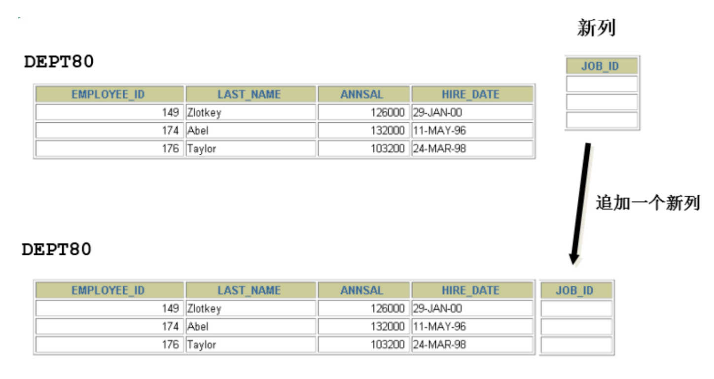

# 第10章 创建和管理表

## 1. 基础知识

### 1.1 一条数据存储的过程

**存储数据是处理数据的第一步**。只有正确地把数据存储起来，才能进行有效地处理和分析。否则，只能是一团乱麻，无从下手。

那么，怎样才能把用户各种经营相关的、纷繁复杂的数据，有序、高效地存储起来呢？在 MySQL 中，一个完整的数据存储过程总共有 4 步，分别是创建数据库、确认字段、创建数据表、插入数据。


为什么要先创建一个数据库，而不是直接创建数据表呢？

因为从系统架构的层次上看，MySQL 数据库系统从大到小依次是`数据库服务器`、`数据库`、`数据表`、数据表的`行与列`。

MySQL 数据库服务器之前已经安装。所以，就从创建数据库开始。

### 1.2 标识符命名规则

* 数据库名、表名不得超过30个字符，变量名限制为29个
* 只能包含 A–Z, a–z, 0–9, _共63个字符
* 数据库名、表名、字段名等对象名中间不要包含空格
* 同一个MySQL软件中，数据库不能同名；同一个库中，表不能重名；同一个表中，字段不能重名
* 必须保证字段没有和保留字、数据库系统或常用方法冲突。如果坚持使用，请在SQL语句中使用`（着重号）引起来
* 保持字段名和类型的一致性：在命名字段并为其指定数据类型的时候一定要保证一致性，假如数据类型在一个表里是整数，那在另一个表里可就别变成字符型了

### 1.3 MySQL中的数据类型

|    类型    |                                                  类型举例                                                   |
|:--------:|:-------------------------------------------------------------------------------------------------------:|
|   整数类型   |                           TINYINT、SMALLINT、MEDIUMINT、**INT(或INTEGER)**、BIGINT                           |
|   浮点类型   |                                              FLOAT、DOUBLE                                               |
|  定点数类型   |                                               **DECIMAL**                                               |
|   位类型    |                                                   BIT                                                   |
|  日期时间类型  |                                  YEAR、TIME、**DATE**、DATETIME、TIMESTAMP                                  |
| 文本字符串类型  |                           CHAR、**VARCHAR**、TINYTEXT、TEXT、MEDIUMTEXT、LONGTEXT                            |
|   枚举类型   |                                                  ENUM                                                   |
|   集合类型   |                                                   SET                                                   |
| 二进制字符串类型 |                           BINARY、VARBINARY、TINYBLOB、BLOB、MEDIUMBLOB、LONGBLOB                            |
|  JSON类型  |                                              JSON对象、JSON数组                                              |
|  空间数据类型  | 单值：GEOMETRY、POINT、LINESTRING、POLYGON；<br/>集合：MULTIPOINT、MULTILINESTRING、MULTIPOLYGON、GEOMETRYCOLLECTION |

其中，常用的几类类型介绍如下：

|     数据类型      |                           描述                            |
|:-------------:|:-------------------------------------------------------:|
|      INT      |              从-2^31到2^31-1的整型数据。存储大小为 4个字节              |
|  CHAR(size)   |               定长字符数据。若未指定，默认为1个字符，最大长度255               |
| VARCHAR(size) |             可变长字符数据，根据字符串实际长度保存，**必须指定长度**              |
|  FLOAT(M,D)   | 单精度，占用4个字节，M=整数位+小数位，D=小数位。 D<=M<=255,0<=D<=30，默认M+D<=6 |
|  DOUBLE(M,D)  |         双精度，占用8个字节，D<=M<=255,0<=D<=30，默认M+D<=15         |
| DECIMAL(M,D)  |    高精度小数，占用M+2个字节，D<=M<=65，0<=D<=30，最大取值范围与DOUBLE相同。    |
|     DATE      |                  日期型数据，格式'YYYY-MM-DD'                   |
|     BLOB      |                   二进制形式的长文本数据，最大可达4G                    |
|     TEXT      |                      长文本数据，最大可达4G                       |

## 2. 创建和管理数据库

创建和管理数据库需要相关的权限

可以通过`数据库.表名`跨数据库指定表

### 2.1 创建数据库

* 方式1：创建数据库

```sql
CREATE DATABASE 数据库名;
```

* 方式2：创建数据库并指定字符集

```sql
CREATE DATABASE 数据库名 CHARACTER SET 字符集;
```

或
```sql
CREATE DATABASE 数据库名 CHAR SET 字符集;
```

* 方式3：判断数据库是否已经存在，不存在则创建数据库（推荐）

```sql
CREATE DATABASE IF NOT EXISTS 数据库名;
```

或

```sql
CREATE DATABASE IF NOT EXISTS 数据库名 CHARACTER SET 字符集;
```

  - 如果MySQL中已经存在相关的数据库，则忽略创建语句，不再创建数据库。

> 注意：DATABASE 不能改名。一些可视化工具可以改名，它是建新库，把所有表复制到新库，再删旧库完成的。

### 2.2 使用数据库

* 查看当前所有的数据库

```sql
SHOW DATABASES; #有一个S，代表多个数据库
```

* 查看当前正在使用的数据库

```sql
SELECT DATABASE(); #使用的一个 mysql 中的全局函数
```

* 查看指定库下所有的表

```sql
SHOW TABLES FROM 数据库名;
```

* 查看当前库下所有的表

```sql
SHOW TABLES;
```

* 查看数据库的创建信息

```sql
SHOW CREATE DATABASE 数据库名;
# 或者：
SHOW CREATE DATABASE 数据库名\G
```

```
+----------+---------------------------------------------------------------------------------------------------------------------------------+
| Database | Create Database                                                                                                                 |
+----------+---------------------------------------------------------------------------------------------------------------------------------+
| test1    | CREATE DATABASE `test1` /*!40100 DEFAULT CHARACTER SET utf8mb4 COLLATE utf8mb4_0900_ai_ci */ /*!80016 DEFAULT ENCRYPTION='N' */ |
+----------+---------------------------------------------------------------------------------------------------------------------------------+
1 row in set (0.00 sec)
```

* 使用/切换数据库

```sql
USE 数据库名;
```

> 注意：要操作表格和数据之前必须先指定是对哪个数据库进行操作，否则就要在所有表名前加上"数据库名."。

### 2.3 修改数据库

* 更改数据库字符集

```sql
ALTER DATABASE 数据库名 CHARACTER SET 字符集; #比如：gbk、utf8等
```

### 2.4 删除数据库

* 方式1：删除指定的数据库

```sql
DROP DATABASE 数据库名;
```

* 方式2：删除指定的数据库（推荐）

```sql
DROP DATABASE IF EXISTS 数据库名;
```

## 3. 创建表

* 必须具备：
  - CREATE TABLE权限
  - 存储空间
  
### 3.1 创建方式1

语法格式：

```sql
CREATE TABLE [IF NOT EXISTS] 表名(
    字段1, 数据类型 [约束条件] [默认值],
    字段2, 数据类型 [约束条件] [默认值],
    字段3, 数据类型 [约束条件] [默认值],
    ……
    [表约束条件]
);
```

> 加上了IF NOT EXISTS关键字，则表示：如果当前数据库中不存在要创建的数据表，则创建数据表；如果当前数据库中已经存在要创建的数据表，则忽略建表语句，不再创建数据表。

* 必须指定：
  - 表名
  - 列名(或字段名)，数据类型，长度
* 可选指定：
  - 约束条件
  - 默认值

```sql
-- 创建表
CREATE TABLE emp(
-- int类型
    emp_id   INT,
-- 最多保存20个中英文字符
    emp_name VARCHAR(20),
-- 总位数不超过15位
    salary   DOUBLE,
-- 日期类型
    birthday DATE
);
```

```sql
DESC emp;
```

```
+----------+-------------+------+-----+---------+-------+
| Field    | Type        | Null | Key | Default | Extra |
+----------+-------------+------+-----+---------+-------+
| emp_id   | int         | YES  |     | NULL    |       |
| emp_name | varchar(20) | YES  |     | NULL    |       |
| salary   | double      | YES  |     | NULL    |       |
| birthday | date        | YES  |     | NULL    |       |
+----------+-------------+------+-----+---------+-------+
4 rows in set (0.00 sec)
```

MySQL在执行建表语句时，将id字段的类型设置为int(11)，这里的11实际上是int类型指定的显示宽度，默认的显示宽度为11。也可以在创建数据表的时候指定数据的显示宽度。

* 创建表举例2：

```sql
CREATE TABLE dept(
-- int类型，自增
  deptno INT(2) AUTO_INCREMENT,
  dname  VARCHAR(14),
  loc    VARCHAR(13),
-- 主键
  PRIMARY KEY (deptno)
);
```

```sql
DESCRIBE dept;
```

```
+--------+-------------+------+-----+---------+----------------+
| Field  | Type        | Null | Key | Default | Extra          |
+--------+-------------+------+-----+---------+----------------+
| deptno | int         | NO   | PRI | NULL    | auto_increment |
| dname  | varchar(14) | YES  |     | NULL    |                |
| loc    | varchar(13) | YES  |     | NULL    |                |
+--------+-------------+------+-----+---------+----------------+
3 rows in set (0.01 sec)
```

> 在MySQL 8.x版本中，不再推荐为INT类型指定显示长度，并在未来的版本中可能去掉这样的语法。

如果创建表时没有指定使用的字符集，则默认使用表所在的数据库的字符集。

也可以手动指定表的存储引擎和字符集，ENGINE 设置存储引擎，CHARSET 设置编码。

```sql
CREATE TABLE IF NOT EXISTS `runoob_tbl`(
  `runoob_id`       INT UNSIGNED AUTO_INCREMENT,
  `runoob_title`    VARCHAR(100) NOT NULL,
  `runoob_author`   VARCHAR(40)  NOT NULL,
  `submission_date` DATE,
  PRIMARY KEY (`runoob_id`)
) ENGINE = InnoDB
  DEFAULT CHARSET = utf8;
```

### 3.2 创建方式2

* 基于现有的表创建新的表，同时可以导入数据
* 使用 AS subquery 选项，将创建表和插入数据结合起来


* as 可以省略
* 指定的列和子查询中的列要一一对应
* 通过列名和默认值定义列

```sql
CREATE TABLE emp1 AS SELECT * FROM employees;

CREATE TABLE emp2 AS SELECT * FROM employees WHERE 1=2; -- 创建的emp2是空表
```

```sql
CREATE TABLE dept80
AS
SELECT employee_id, last_name, salary * 12 ANNSAL, hire_date
FROM employees
WHERE department_id = 80;
```

```sql
DESCRIBE dept80;
```

```
+-------------+--------------+------+-----+---------+-------+
| Field       | Type         | Null | Key | Default | Extra |
+-------------+--------------+------+-----+---------+-------+
| employee_id | int          | NO   |     | 0       |       |
| last_name   | varchar(25)  | NO   |     | NULL    |       |
| ANNSAL      | double(22,2) | YES  |     | NULL    |       |
| hire_date   | date         | NO   |     | NULL    |       |
+-------------+--------------+------+-----+---------+-------+
4 rows in set (0.01 sec)
```

### 3.3 查看数据表结构

在MySQL中创建好数据表之后，可以查看数据表的结构。MySQL支持使用`DESCRIBE/DESC`语句查看数据表结构，也支持使用`SHOW CREATE TABLE`语句查看数据表结构。

语法格式如下：
```sql
SHOW CREATE TABLE 表名;
```

使用SHOW CREATE TABLE语句不仅可以查看表创建时的详细语句，还可以查看存储引擎和字符编码。

举例：

```
+-------+-----------------------------------------
| Table | Create Table                                                                                                                                                                                    |
+-------+-----------------------------------------
| emp   | CREATE TABLE `emp` (
  `emp_id` int DEFAULT NULL,
  `emp_name` varchar(20) DEFAULT NULL,
  `salary` double DEFAULT NULL,
  `birthday` date DEFAULT NULL
) ENGINE=InnoDB DEFAULT CHARSET=utf8mb3 |
+-------+-----------------------------------------
1 row in set (0.00 sec)
```

### 3.4 创建临时表

在 create 后加上 temporary 即可创建临时表

每个会话只能看到自己创建的临时表，不同的会话可以创建相同表名称的临时表。临时表的表名可以和永久表的名字相同

show tables语句不会列出临时表，在information_schema中也不存在临时表信息；show create table可以查看临时表的相关信息

方式1：

```sql
create temporary table student_copy(
  　　id   int primary key,
  　　name varchar(20)
) Engine = InnoDB 
  default charset utf8;
```

方式2：

```sql
CREATE TEMPORARY TABLE a 
SELECT SUM(sales_value) AS sales_value
FROM sales;
```

#### 优点

1. 可以利用临时表保存一些临时数据，断开会话自动清除数据

#### 缺点

1. 与服务器意外断开会话，临时表将被删除。
2. 临时表只对创建会话可见，所以和线程池连接技术不能同时共用
3. 可能会跟永久表冲突，导致重连之后误操作永久表中的数据。为了避免删除相同表明的永久表，执行删除表结构的时候可以使用drop temporary table_name;
4. 临时表应在 memory、myisam、merge 或者 innodb 上使用，并且不支持mysql cluster簇
5. 不能使用rename来重命名临时表。但是可以alter table rename代替：
    - mysql>ALTER TABLE orig_name RENAME new_name;
6. 但在同一个query语句中，相同的临时表只能出现一次。如：
    * 可以使用：mysql> select * from temp_tb;
    * 但不能使用：mysql> select * from temp_tb, temp_tb as t;
    * 错误信息：ERROR 1137 (HY000): Can't reopen table: 'temp_tb'             
    * 同样相同临时表不能在存储函数中出现多次，如果在一个存储函数里，用不同的别名查找一个临时表多次，或者在这个存储函数里用不同的语句查找，都会出现这个错误。

## 4. 修改表

修改表指的是修改数据库中已经存在的数据表的结构。

使用 ALTER TABLE 语句可以实现：
* 向已有的表中添加列
* 修改现有表中的列
* 删除现有表中的列
* 重命名现有表中的列

### 4.1 追加一个列

语法格式如下：

```sql
ALTER TABLE 表名 ADD [COLUMN] 字段名 字段类型 [FIRST|AFTER 字段名];
```

举例：

```sql
ALTER TABLE dept80 
ADD job_id varchar(15); # 默认添加到表中的最后一个字段的位置
```



```sql
ALTER TABLE dept80
ADD phone_number VARCHAR(20) FIRST; # 加上FIRST关键字后就添加到表的第一个字段的位置
```

### 4.2 修改一个列

* 可以修改列的数据类型，长度、默认值和位置
* 修改字段数据类型、长度、默认值、位置的语法格式如下：

```sql
ALTER TABLE 表名 MODIFY [COLUMN] 字段名1 字段类型 [DEFAULT 默认值][FIRST|AFTER 字段名2];
```

举例：

```sql
ALTER TABLE dept80
MODIFY last_name VARCHAR(30);
```

```sql
ALTER TABLE dept80
MODIFY salary double(9,2) default 1000;
```

* default关键字是用来设置列的默认值的，如果在插入某一行数据时没有写入这列的数据，那么就会填充该列的默认值

### 4.3 重命名一个列

使用`CHANGE old_column new_column dataType`子句重命名列。语法格式如下：

```sql
ALTER TABLE 表名 CHANGE [column] 列名 新列名 新数据类型;
```

在修改列名的同时也可以修改数据类型等其他属性

### 4.4 删除一个列

删除表中某个字段的语法格式如下：

```sql
ALTER TABLE 表名 DROP [COLUMN] 字段名
```

举例：

```sql
ALTER TABLE dept80
DROP COLUMN salary;
```

## 5. 重命名表

* 必须具有对应的权限
* 方式一：使用RENAME

```sql
RENAME TABLE emp
TO myemp;
```

* 方式二：使用ALTER

```sql
ALTER table dept
RENAME [TO] detail_dept; -- [TO]可以省略
```

## 6. 删除表

* 在MySQL中，当一张数据表`没有与其他任何数据表形成关联关系`时，可以将该数据表直接删除。
* 数据和结构都被删除
* 所有正在运行的相关事务被提交
* 所有相关索引被删除
* 语法格式：

```sql
DROP TABLE [IF EXISTS] 数据表1 [, 数据表2, …, 数据表n];
```

`IF EXISTS`的含义为：如果当前数据库中存在相应的数据表，则删除数据表；如果当前数据库中不存
在相应的数据表，则忽略删除语句，不再执行删除数据表的操作。

* 举例：

```sql
DROP TABLE dept80;
```

* DROP TABLE 语句不能回滚

## 7. 清空表

* TRUNCATE TABLE语句：
  - 删除表中所有的数据
  - 释放表的存储空间
* 举例：

```sql
TRUNCATE TABLE dept80;
```

* TRUNCATE语句不能回滚，而使用 DELETE 语句删除数据，可以回滚

> 阿里开发规范：
> 
> 【参考】 TRUNCATE TABLE 比 DELETE 速度快，且使用的系统和事务日志资源少，但 TRUNCATE 无事务且不触发 TRIGGER，有可能造成事故，故不建议在开发代码中使用此语句。
> 
> 说明：TRUNCATE TABLE 在功能上与不带 WHERE 子句的 DELETE 语句相同。

## 8. COMMENT

在创建表时，字段或列的注释可以用COMMENT关键字来添加

```sql
create table test(
  id int not null default 0 comment '用户id'
);
```

如果是已经建好的表，也可以用修改字段的命令，然后加上comment关键字和定义，就可以添加上注释了。

```sql
alter table test
change  id int not null default 0 comment '测试表id' ;
```

查看已有表的所有字段的注释：

```sql
show full columns from table;
```

例如：

```sql
show full columns from test
```

### 总结

```sql
# 1. 创建表的时候写注释
create table test1(
    field_name int comment '字段的注释'
)comment='表的注释';
 
# 2. 修改表的注释
alter table test1 comment '修改后的表的注释';
 
# 3. 修改字段的注释
alter table test1 modify column field_name int comment '修改后的字段注释';
# 字段名和字段类型照写就行
 
# 4. 查看表注释的方法
# 在生成的SQL语句中看
show  create  table  test1;
# 在元数据的表里面看
use information_schema;
select * from TABLES where TABLE_SCHEMA='my_db' and TABLE_NAME='test1' \G
 
# 5. 查看字段注释的方法
# show
show  full  columns  from  test1;
# 在元数据的表里面看
select * from COLUMNS where TABLE_SCHEMA='my_db' and TABLE_NAME='test1' \G
```

## 9. 相关内容

### DCL 中 COMMIT 和 ROLLBACK

COMMIT：提交数据。一旦执行COMMIT，则数据就被永久的保存在了数据库中，意味着数据不可以回滚。默认每句SQL都是自动COMMIT（提交）的

```sql
SET autocommit  = false; # 设置不自动提交数据

# 此时对某张表中的数据进行了增删改操作

COMMIT; # 执行完此句后数据的改动才被真正保存了下来
```

ROLLBACK：回滚数据。一旦执行ROLLBACK，则可以实现数据的回滚。回滚到最近的一次COMMIT之后。

```sql
SET autocommit  = false; # 设置不自动提交数据

# 此时对某张表中的数据进行了增删改操作

ROLLBACK; # 将表中的数据还原为上一次COMMIT后的状态，刚刚对表数据的操作被撤销了
```

### 对比 TRUNCATE TABLE 和 DELETE FROM

* 相同点：都可以实现对表中所有数据的删除，同时保留表结构。
* 不同点：
  - TRUNCATE TABLE：一旦执行此操作，表数据全部清除。同时，数据是不可以回滚的。
  - DELETE FROM：一旦执行此操作，表数据可以全部清除（不带WHERE）。同时，数据是可以实现回滚的。

### DDL 和 DML 的说明

1. DDL的操作一旦执行，就不可回滚。指令`SET autocommit = FALSE`对DDL操作失效。（因为在执行完DDL操作之后，一定会执行一次COMMIT。而此COMMIT操作不受`SET autocommit = FALSE`影响的）

2. DML的操作默认情况，一旦执行，也是不可回滚的。但是，如果在执行DML之前，执行了`SET autocommit = FALSE`，则执行的DML操作就可以实现回滚（使用ROLLBACK进行回滚）

## 10. 内容拓展

### 拓展1：阿里巴巴《Java开发手册》之MySQL字段命名

* 【强制】 表名、字段名必须使用小写字母或数字，禁止出现数字开头，禁止两个下划线中间只出现数字。数据库字段名的修改代价很大，因为无法进行预发布，所以字段名称需要慎重考虑。
  - 正例：aliyun_admin，rdc_config，level3_name
  - 反例：AliyunAdmin，rdcConfig，level_3_name
* 【强制】 禁用保留字，如 desc、range、match、delayed 等，请参考 MySQL 官方保留字。
* 【强制】 表必备三字段：id, gmt_create, gmt_modified。
  - 说明：其中 id 必为主键，类型为BIGINT UNSIGNED、单表时自增、步长为 1。gmt_create, gmt_modified 的类型均为 DATETIME 类型，前者现在时表示主动式创建，后者过去分词表示被动式更新
* 【推荐】 表的命名最好是遵循 “业务名称_表的作用”。
正例：alipay_task 、 force_project、 trade_config
* 【推荐】 库名与应用名称尽量一致。
* 【参考】合适的字符存储长度，不但节约数据库表空间、节约索引存储，更重要的是提升检索速度。
  - 正例：无符号值可以避免误存负数，且扩大了表示范围。

|  对象  |  年龄区间  |        类型         | 字节  |      表示范围       |
|:----:|:------:|:-----------------:|:---:|:---------------:|
|  人   | 150岁之间 | tinyint unsigned  |  1  |   无符号值：0到255    |
|  龟   |  数百岁   | smallint unsigned |  2  |  无符号值：0到65535   |
| 恐龙化石 |  数千万年  |   int unsigned    |  4  |   无符号值：0到约43亿   |
|  太阳  | 约50亿年  |  bigint unsigned  |  8  | 无符号值：0到约10的19次方 |

### 拓展2：如何理解清空表、删除表等操作需谨慎？！

`表删除`操作将把表的定义和表中的数据一起删除，并且MySQL在执行删除操作时，不会有任何的确认信息提示，因此执行删除操时应当慎重。在删除表前，最好对表中的数据进行`备份`，这样当操作失误时可以对数据进行恢复，以免造成无法挽回的后果。

同样的，在使用`ALTER TABLE`进行表的基本修改操作时，在执行操作过程之前，也应该确保对数据进行完整的`备份`，因为数据库的改变是`无法撤销`的，如果添加了一个不需要的字段，可以将其删除；相同的，如果删除了一个需要的列，该列下面的所有数据都将会丢失。

### 拓展3：MySQL8新特性—DDL的原子化

在MySQL 8.0版本中，InnoDB表的DDL支持事务完整性，即`DDL操作要么成功要么回滚`。DDL操作回滚日志写入到data dictionary数据字典表mysql.innodb_ddl_log（该表是隐藏的表，通过show tables无法看到）中，用于回滚操作。通过设置参数，可将DDL操作日志打印输出到MySQL错误日志中。

分别在MySQL 5.7版本和MySQL 8.0版本中创建数据库和数据表，结果如下：

```sql
CREATE DATABASE mytest;
USE mytest;
CREATE TABLE book1(
  book_id   INT,
  book_name VARCHAR(255)
);
SHOW TABLES;
```

（1）在MySQL 5.7版本中，测试步骤如下： 删除数据表book1和数据表book2，结果如下：

```
mysql> DROP TABLE book1,book2;
ERROR 1051 (42S02): Unknown table 'mytest.book2'
```

再次查询数据库中的数据表名称，结果如下：

```
mysql> SHOW TABLES;
Empty set (0.00 sec)
```

从结果可以看出，虽然删除操作时报错了，但是仍然删除了数据表book1。

（2）在MySQL 8.0版本中，测试步骤如下： 删除数据表book1和数据表book2，结果如下：

```
mysql> DROP TABLE book1,book2;
ERROR 1051 (42S02): Unknown table 'mytest.book2'
```

再次查询数据库中的数据表名称，结果如下：

```
mysql> show tables;
+------------------+
| Tables_in_mytest |
+------------------+
| book1 |
+------------------+
1 row in set (0.00 sec)
```

从结果可以看出，数据表book1并没有被删除。

由于DDL的原子化，删除book2表的报错阻止了删除book1表的操作，因为原子化要求在执行一个操作时如果内部发生了错误就要全部回滚

## [相关代码](第10章_创建和管理表.sql)

## [练习](第10章章节练习.md)