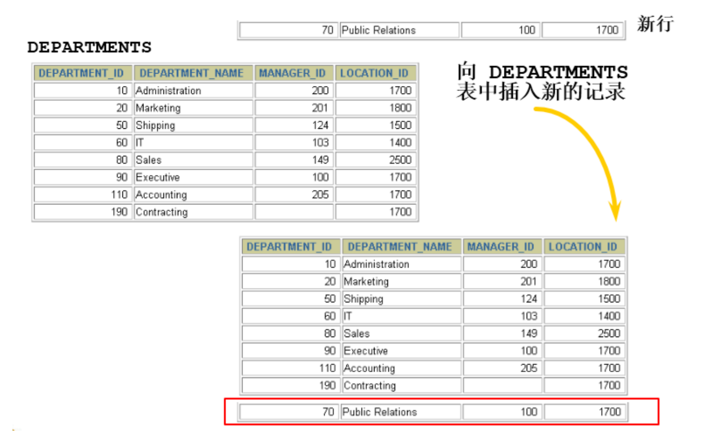
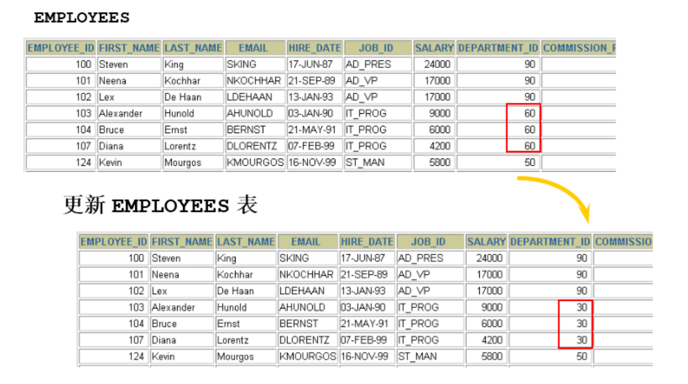
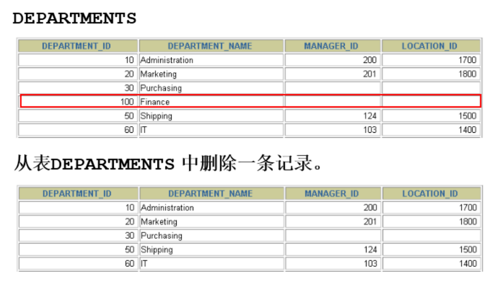

# 第11章 数据处理之增删改

## 1. 插入数据

1.1 实际问题



解决方式：使用 INSERT 语句向表中插入数据。

### 1.2 方式1：VALUES的方式添加

使用这种语法一次只能向表中插入一条数据。

#### 情况1：为表的所有字段按默认顺序插入数据

```
INSERT INTO 表名
VALUES (value1,value2,....);
```

值列表中需要为表的每一个字段指定值，并且值的顺序必须和数据表中字段定义时的顺序相同。

举例：

```
INSERT INTO departments
VALUES (70, 'Pub', 100, 1700);
```

```
INSERT INTO departments
VALUES (100, 'Finance', NULL, NULL);
```

#### 情况2：为表的指定字段插入数据

```
INSERT INTO 表名(column1 [, column2, …, columnn])
VALUES (value1 [,value2, …, valuen]);
```

为表的指定字段插入数据，就是在INSERT语句中只向部分字段中插入值，而其他字段的值为表定义时的默认值。

在 INSERT 子句中列出列名，但是一旦列出，VALUES中要插入的value1,....valuen需要与column1,...columnn列一一对应。如果类型不同，将无法插入，并且MySQL会产生错误。

举例：

```
INSERT INTO departments(department_id, department_name)
VALUES (80, 'IT');
```

#### 情况3：同时插入多条记录

INSERT语句可以同时向数据表中插入多条记录，插入时指定多个值列表，每个值列表之间用逗号分隔开，基本语法格式如下：

```
INSERT INTO table_name
VALUES
(value1 [,value2, …, valuen]),
(value1 [,value2, …, valuen]),
……
(value1 [,value2, …, valuen]);
```

或者

```
INSERT INTO table_name(column1 [, column2, …, columnn])
VALUES
(value1 [,value2, …, valuen]),
(value1 [,value2, …, valuen]),
……
(value1 [,value2, …, valuen]);
```

举例：

```
mysql> INSERT INTO emp(emp_id,emp_name)
-> VALUES (1001,'shkstart'),
-> (1002,'atguigu'),
-> (1003,'Tom');
Query OK, 3 rows affected (0.00 sec)
Records: 3 Duplicates: 0 Warnings: 0
```

使用INSERT同时插入多条记录时，MySQL会返回一些在执行单行插入时没有的额外信息，这些信息的含义如下： 
* Records：表明插入的记录条数。 
* Duplicates：表明插入时被忽略的记录，原因可能是这些记录包含了重复的主键值。 
* Warnings：表明有问题的数据值，例如发生数据类型转换。

> 一个同时插入多行记录的INSERT语句等同于多个单行插入的INSERT语句，但是多行的INSERT语句在处理过程中 效率更高 。因为MySQL执行单条INSERT语句插入多行数据比使用多条INSERT语句快，所以在插入多条记录时最好选择使用单条INSERT语句的方式插入。

#### 小结

* VALUES 也可以写成 VALUE ，但是VALUES是标准写法。
* 字符和日期型数据应包含在单引号中。

### 1.3 方式2：将查询结果插入到表中

INSERT还可以将SELECT语句查询的结果插入到表中，此时不需要把每一条记录的值一个一个输入，只需要使用一条INSERT语句和一条SELECT语句组成的组合语句即可快速地从一个或多个表中向一个表中插入多行。

基本语法格式如下：

```
INSERT INTO 目标表名
(tar_column1 [, tar_column2, …, tar_columnn])
SELECT
(src_column1 [, src_column2, …, src_columnn])
FROM 源表名
[WHERE condition]
```

* 在 INSERT 语句中加入子查询。
* 不必书写 VALUES 子句。
* 子查询中的值列表应与 INSERT 子句中的列名对应。

举例：

```
INSERT INTO emp2
SELECT *
FROM employees
WHERE department_id = 90;

INSERT INTO sales_reps(id, name, salary, commission_pct)
SELECT employee_id, last_name, salary, commission_pct
FROM employees
WHERE job_id LIKE '%REP%';
```

### 提示

在往表中插入数据时，插入的字段要能完全容纳插入的数据，否则会有添加不成功的风险

例如一个表的字段类型为varchar(25)，往另一张表的类型为varchar(15)的字段添加数据时，如果原表字段中有一条数据的长度超过了15，那么添加就会失败

## 2. 更新数据



* 使用 UPDATE 语句更新数据。语法如下：

```
UPDATE table_name
SET column1=value1, column2=value2, … , column=valuen
[WHERE condition]
```

* 可以一次更新多条数据。
* 如果需要回滚数据，需要保证在DML前，进行设置：SET AUTOCOMMIT = FALSE;
* 使用 WHERE 子句指定需要更新的数据。

```
UPDATE employees
SET department_id = 70
WHERE employee_id = 113;
```

* 如果省略 WHERE 子句，则表中的所有数据都将被更新。

```
UPDATE copy_emp
SET department_id = 110;

#同时修改一条数据的多个字段
UPDATE emp1
SET hire_date = CURDATE(),
    salary    = 6000
WHERE id = 4;

#题目：将表中姓名中包含字符a的提薪20%
UPDATE emp1
SET salary = salary * 1.2
WHERE NAME LIKE '%a%';
```

* 更新中的数据完整性错误

```
UPDATE employees
SET department_id = 55
WHERE department_id = 110;
```

```
ERROR 1452 (23000): Cannot add or update a child row: a foreign key constraint fails (`atguigudb`.`employees`, CONSTRAINT `emp_dept_fk` FOREIGN KEY (`department_id`) REFERENCES `departments` (`department_id`))
```

> 说明：存在外键约束，departments表不存在55号部门

## 3. 删除数据



* 使用 DELETE 语句从表中删除数据

```
DELETE FROM table_name 
[WHERE <condition>];
```

table_name指定要执行删除操作的表；“[WHERE ]”为可选参数，指定删除条件，如果没有WHERE子句，DELETE语句将删除表中的所有记录。

* 使用 WHERE 子句删除指定的记录。

```
DELETE FROM departments
WHERE department_name = 'Finance';
```

* 如果省略 WHERE 子句，则表中的全部数据将被删除

```
DELETE FROM copy_emp;
```

* 删除中的数据完整性错误

```
DELETE FROM departments
WHERE department_id = 60;
```

```
ERROR 1451 (23000): Cannot delete or update a parent row: a foreign key constraint fails (`atguigudb`.`employees`, CONSTRAINT `emp_dept_fk` FOREIGN KEY (`department_id`) REFERENCES `departments` (`department_id`))
```

> 说明：由于要删除的记录作为外键约束了其他表的数据，故不能删除

## 4. MySQL8新特性：计算列

什么叫计算列呢？简单来说就是某一列的值是通过别的列计算得来的。例如，a列值为1、b列值为2，c列不需要手动插入，定义a+b的结果为c的值，那么c就是计算列，是通过别的列计算得来的。

在MySQL 8.0中，CREATE TABLE 和 ALTER TABLE 中都支持增加计算列。下面以CREATE TABLE为例进行讲解。

举例：定义数据表tb1，然后定义字段id、字段a、字段b和字段c，其中字段c为计算列，用于计算a+b的值。 首先创建测试表tb1，语句如下：

```
CREATE TABLE tb1(
id INT,
a INT,
b INT,
c INT GENERATED ALWAYS AS (a + b) VIRTUAL
);
```

插入演示数据，语句如下：

```
INSERT INTO tb1(a,b) VALUES (100,200);
```

查询数据表tb1中的数据，结果如下：

```
mysql> SELECT * FROM tb1;
+------+------+------+------+
| id   | a    | b    | c    |
+------+------+------+------+
| NULL |  100 |  200 |  300 |
+------+------+------+------+
1 row in set (0.00 sec)
```

更新数据中的数据，语句如下：
```
UPDATE tb1 SET a = 500;
```

再次查询：
```
mysql> SELECT * FROM tb1;
+------+------+------+------+
| id   | a    | b    | c    |
+------+------+------+------+
| NULL |  500 |  200 |  700 |
+------+------+------+------+
1 row in set (0.00 sec)
```

## [5. 综合案例](综合案例.md)

## [相关代码](第11章_数据处理之增删改.sql)

## [练习](第11章章节练习.md)