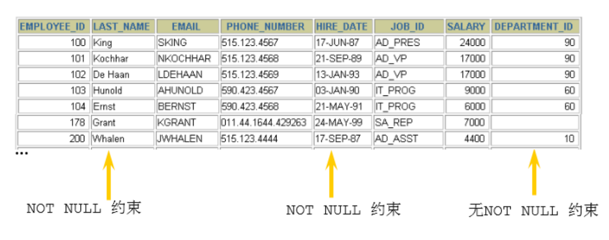
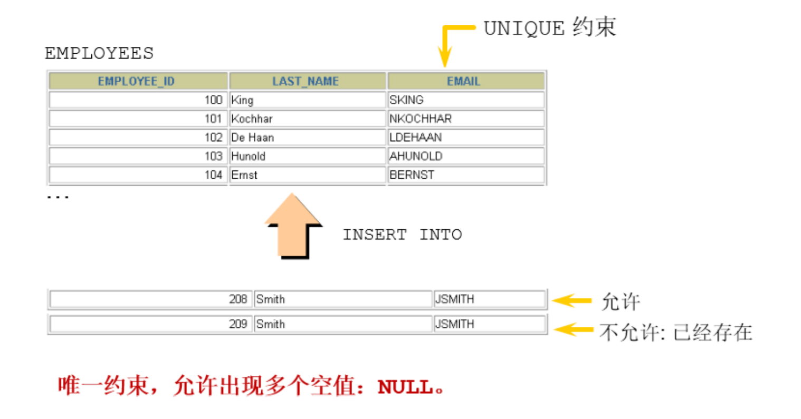
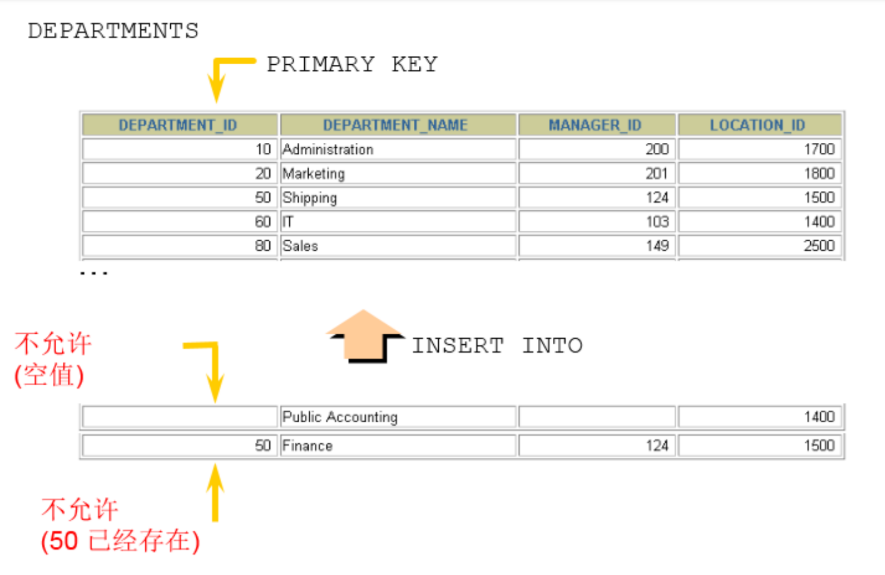

# 第13章 约束

## 1. 约束(constraint)概述

### 1.1 为什么需要约束

数据完整性（Data Integrity）是指数据的精确性（Accuracy）和可靠性（Reliability）。它是防止数据库中存在不符合语义规定的数据和防止因错误信息的输入输出造成无效操作或错误信息而提出的。

为了保证数据的完整性，SQL规范以约束的方式**对表数据进行额外的条件限制**。从以下四个方面考虑：

* `实体完整性（Entity Integrity）`：例如，同一个表中，不能存在两条完全相同无法区分的记录
* `域完整性（Domain Integrity）`：例如：年龄范围0-120，性别范围“男/女”
* `引用完整性（Referential Integrity）`：例如：员工所在部门，在部门表中要能找到这个部门
* `用户自定义完整性（User-defined Integrity）`：例如：用户名唯一、密码不能为空等，本部门经理的工资不得高于本部门职工的平均工资的5倍。

### 1.2 什么是约束

约束是表级的强制规定。

可以在**创建表时规定约束（通过 CREATE TABLE 语句）**，或者在**表创建之后通过 ALTER TABLE 语句规定约束**。

### 1.3 约束的分类

* 根据约束数据列的限制，约束可分为：
    - 单列约束：每个约束只约束一列
    - 多列约束：每个约束可约束多列数据
* 根据约束的作用范围，约束可分为：
    - 列级约束：只能作用在一个列上，跟在列的定义后面
    - 表级约束：可以作用在多个列上，不与列一起，而是单独定义

|      |   位置   |    支持的约束类型    |  是否可以起约束名  |
|:----:|:------:|:-------------:|:----------:|
| 列级约束 |  列的后面  | 语法都支持，但外键没有效果 |    不可以     |
| 表级约束 | 所有列的下面 | 默认和非空不支持，其他支持 | 可以（主键没有效果） |

* 根据约束起的作用，约束可分为：
    - NOT NULL 非空约束，规定某个字段不能为空
    - UNIQUE 唯一约束，规定某个字段在整个表中是唯一的
    - PRIMARY KEY 主键(非空且唯一)约束
    - FOREIGN KEY 外键约束
    - CHECK 检查约束
    - DEFAULT 默认值约束

> 注意： MySQL不支持check约束，但可以使用check约束，而没有任何效果

```sql
# information_schema数据库名（系统库）
# table_constraints表名称（专门存储各个表的约束）
SELECT *
FROM information_schema.table_constraints
WHERE table_name = '表名称';
```

## 2. 非空约束

### 2.1 作用

限定某个字段/某列的值不允许为空



### 2.2 关键字

NOT NULL

### 2.3 特点

* 非空约束是列级约束
* 默认，所有的类型的值都可以是NULL，包括INT、FLOAT等数据类型
* 非空约束只能出现在表对象的列上，只能某个列单独限定非空，不能组合非空
* 一个表可以有很多列都分别限定了非空
* 空字符串''不等于NULL，0也不等于NULL

### 2.4 添加非空约束

#### 建表时

```
CREATE TABLE 表名称(
    字段名 数据类型,
    字段名 数据类型 NOT NULL,
    字段名 数据类型 NOT NULL
);
```

举例：

```sql
CREATE TABLE emp
(
    id   INT(10)     NOT NULL,
    NAME VARCHAR(20) NOT NULL,
    sex  CHAR        NULL
);
```

```sql
CREATE TABLE student
(
    sid    int,
    sname  varchar(20) not null,
    tel    char(11),
    cardid char(18)    not null
);
```

```
insert into student values(1,'张三','13710011002','110222198912032545'); #成功

insert into student values(2,'李四','13710011002',null);#身份证号为空
ERROR 1048 (23000): Column 'cardid' cannot be null

insert into student values(2,'李四',null,'110222198912032546');#成功，tel允许为空

insert into student values(3,null,null,'110222198912032547');#失败
ERROR 1048 (23000): Column 'sname' cannot be null
```

### 修改表

```
alter table 表名称 modify 字段名 数据类型 not null;
```

举例：

```
ALTER TABLE emp MODIFY sex VARCHAR(30) NOT NULL;

alter table student modify sname varchar(20) not null;
```

### 2.5 删除非空约束

```
#去掉not null，相当于修改某个非注解字段，该字段允许为空
alter table 表名称 modify 字段名 数据类型 NULL;

# 或

#去掉not null，相当于修改某个非注解字段，该字段允许为空
alter table 表名称 modify 字段名 数据类型;
```

举例：

```
ALTER TABLE emp MODIFY sex VARCHAR(30) NULL;

ALTER TABLE emp MODIFY NAME VARCHAR(15) DEFAULT 'abc' NULL;
```

## 3. 唯一性约束

### 3.1 作用

用来限制某个字段/某列的值不能重复。



### 3.2 关键字

UNIQUE

### 3.3 特点

* 既是表级约束，又是列级约束
* 同一个表可以有多个唯一约束。
* 唯一约束可以是某一个列的值唯一，也可以多个列组合的值唯一。
* 唯一性约束允许列值为空。
* 在创建唯一约束的时候，如果不给唯一约束命名，就默认和列名相同。
* MySQL会给唯一约束的列上默认创建一个唯一索引。

### 3.4 添加唯一约束

#### 1. 建表时

```
create table 表名称(
    字段名 数据类型,
    字段名 数据类型 unique,
    字段名 数据类型 unique key,
    字段名 数据类型
);

create table 表名称(
    字段名 数据类型,
    字段名 数据类型,
    字段名 数据类型,
    [constraint 约束名] unique key(字段名)
);
```

`constraint`关键字用于添加约束名，在删除约束时要用到，如果不写默认为列名

```sql
create table student
(
    sid    int,
    sname  varchar(20),
    tel    char(11) unique,
    cardid char(18) unique key
);

CREATE TABLE t_course
(
    cid         INT UNIQUE,
    cname       VARCHAR(100) UNIQUE,
    description VARCHAR(200)
);

CREATE TABLE USER
(
    id       INT NOT NULL,
    NAME     VARCHAR(25),
    PASSWORD VARCHAR(16),
-- 使用表级约束语法
# 表示用户名和密码组合不能重复
    CONSTRAINT uk_name_pwd UNIQUE (NAME, PASSWORD)
);
```

```
insert into student values(1,'张三','13710011002','101223199012015623');
  
insert into student values(2,'李四','13710011003','101223199012015624');

mysql> select * from student;
+------+-------+-------------+--------------------+
| sid  | sname | tel         | cardid             |
+------+-------+-------------+--------------------+
|    1 | 张三  | 13710011002 | 101223199012015623 |
|    2 | 李四  | 13710011003 | 101223199012015624 |
+------+-------+-------------+--------------------+
2 rows in set (0.00 sec)

insert into student values(3,'王五','13710011004','101223199012015624'); #身份证号重复
ERROR 1062 (23000): Duplicate entry '101223199012015624' for key 'cardid'

insert into student values(3,'王五','13710011003','101223199012015625');
ERROR 1062 (23000): Duplicate entry '13710011003' for key 'tel'
```

#### 2. 建表后指定唯一键约束

```
# 字段列表中如果是一个字段，表示该列的值唯一。如果是两个或更多个字段，那么复合唯一，即多个字段的组合是唯一的
# 方式1：
alter table 表名称 add unique key(字段列表);

# 方式2：
alter table 表名称 modify 字段名 字段类型 unique;
```

举例：

```
ALTER TABLE USER
ADD UNIQUE(NAME,PASSWORD);

ALTER TABLE USER
ADD CONSTRAINT uk_name_pwd UNIQUE(NAME,PASSWORD);

ALTER TABLE USER
MODIFY NAME VARCHAR(20) UNIQUE;
```

```sql
create table student(
    sid    int primary key,
    sname  varchar(20),
    tel    char(11),
    cardid char(18)
);

alter table student
    add unique key (tel);

alter table student
    add unique key (cardid);
```

### 3.5 关于复合唯一约束

```
create table 表名称(
  字段名 数据类型,
  字段名 数据类型,
  字段名 数据类型,
# 字段列表中写的是多个字段名，多个字段名用逗号分隔，表示那么是复合唯一，即多个字段的组合是唯一的
  unique key (字段列表)
);
```

#### 环境准备

```sql
#学生表
create table student(
  sid    int,                 #学号
  sname  varchar(20),         #姓名
  tel    char(11) unique key, #电话
  cardid char(18) unique key  #身份证号
);

#课程表
create table course(
  cid   int,        #课程编号
  cname varchar(20) #课程名称
);

#选课表
create table student_course
(
  id    int,
  sid   int,
  cid   int,
  score int,
  unique key (sid, cid) #复合唯一
);

#成功
insert into student values(1,'张三','13710011002','101223199012015623');
#成功 
insert into student values(2,'李四','13710011003','101223199012015624');
#成功  
insert into course values(1001,'Java'),(1002,'MySQL');
#成功
insert into student_course
values (1, 1, 1001, 89),
       (2, 1, 1002, 90),
       (3, 2, 1001, 88),
       (4, 2, 1002, 56);
```

```
mysql> select * from student;
+------+-------+-------------+--------------------+
| sid  | sname | tel         | cardid             |
+------+-------+-------------+--------------------+
|    1 | 张三  | 13710011002 | 101223199012015623 |
|    2 | 李四  | 13710011003 | 101223199012015624 |
+------+-------+-------------+--------------------+
2 rows in set (0.01 sec)

mysql> select * from course;
+------+-------+
| cid  | cname |
+------+-------+
| 1001 | Java  |
| 1002 | MySQL |
+------+-------+
2 rows in set (0.00 sec)

mysql> select * from student_course;
+------+------+------+-------+
| id   | sid  | cid  | score |
+------+------+------+-------+
|    1 |    1 | 1001 |    89 |
|    2 |    1 | 1002 |    90 |
|    3 |    2 | 1001 |    88 |
|    4 |    2 | 1002 |    56 |
+------+------+------+-------+
4 rows in set (0.00 sec)
```

#### 测试

```sql
#失败
insert into student_course values (5, 1, 1001, 88);

# [23000][1062] Duplicate entry '1-1001' for key 'student_course.sid' 违反sid-cid的复合唯一
```

### 3.5 删除唯一约束

* 添加唯一性约束的列上也会自动创建唯一索引。
* 删除唯一约束只能通过删除唯一索引的方式删除。
* 删除时需要指定唯一索引名，唯一索引名就和唯一约束名一样。
* 如果创建唯一约束时未指定名称，如果是单列，就默认和列名相同；如果是组合列，那么默认和()中排在第一个的列名相同。也可以自定义唯一性约束名。

```sql
#查看都有哪些约束
SELECT * FROM information_schema.table_constraints WHERE table_name = '表名'; 
```

```
ALTER TABLE USER
DROP INDEX uk_name_pwd;
```

> 注意：可以通过`show index from 表名称;`查看表的索引

## 4. PRIMARY KEY 约束

### 4.1 作用 

用来唯一标识表中的一行记录。

### 4.2 关键字

primary key

### 4.3 特点

* 主键约束相当于`唯一约束+非空约束的组合`，主键约束列不允许重复，也不允许出现空值。



* 一个表最多只能有一个主键约束，建立主键约束可以在列级别创建，也可以在表级别上创建。（既是列级约束又是表级约束）
* 主键约束对应着表中的一列或者多列（复合主键）
* 如果是多列组合的复合主键约束，那么这些列都不允许为空值，并且组合的值不允许重复。
* `MySQL的主键名总是PRIMARY`，就算自己命名了主键约束名也没用。
* 当创建主键约束时，系统默认会在所在的列或列组合上建立对应的`主键索引`（能够根据主键查询的，就根据主键查询，效率更高）。如果删除主键约束了，主键约束对应的索引就自动删除了。
* 需要注意的一点是，不要修改主键字段的值。因为主键是数据记录的唯一标识，如果修改了主键的值，就有可能会破坏数据的完整性。

### 4.4 添加主键约束 

#### 1. 建表时指定主键约束

```
create table 表名称(
    字段名 数据类型 primary key, #列级模式
    字段名 数据类型,
    字段名 数据类型
);

create table 表名称(
    字段名 数据类型,
    字段名 数据类型,
    字段名 数据类型,
    [constraint 约束名] primary key(字段名) #表级模式
);
```

举例：

```sql
create table temp(
  id   int primary key,
  name varchar(20)
);

# 成功
insert into temp values(1,'张三');
# 成功
insert into temp values(2,'李四');
```

```
mysql> desc temp;
+-------+-------------+------+-----+---------+-------+
| Field | Type        | Null | Key | Default | Extra |
+-------+-------------+------+-----+---------+-------+
| id    | int         | NO   | PRI | NULL    |       |
| name  | varchar(20) | YES  |     | NULL    |       |
+-------+-------------+------+-----+---------+-------+
2 rows in set (0.00 sec)

mysql> select * from temp;
+----+------+
| id | name |
+----+------+
|  1 | 张三 |
|  2 | 李四 |
+----+------+
2 rows in set (0.00 sec)
```

```sql
# 失败
insert into temp values(1,'张三');
# ERROR 1062 (23000): Duplicate（重复） entry（键入，输入） '1' for key 'PRIMARY'

# 失败
insert into temp values(1,'王五');
# ERROR 1062 (23000): Duplicate entry '1' for key 'PRIMARY'

# 成功  
insert into temp values(3,'张三');
```

```
mysql> select * from temp;
+----+------+
| id | name |
+----+------+
|  1 | 张三 |
|  2 | 李四 |
|  3 | 张三 |
+----+------+
3 rows in set (0.00 sec)
```

```sql
# 成功
insert into temp values(4,null);

# 失败
insert into temp values(null,'李琦');
# ERROR 1048 (23000): Column 'id' cannot be null
```

```
mysql> select * from temp;
+----+------+
| id | name |
+----+------+
|  1 | 张三 |
|  2 | 李四 |
|  3 | 张三 |
|  4 | NULL |
+----+------+
4 rows in set (0.00 sec)
```

```
#演示一个表建立两个主键约束
create table temp(
  id   int primary key,
  name varchar(20) primary key
);
# ERROR 1068 (42000): Multiple（多重的） primary key defined（定义）
```

再举例：

* 列级约束

```sql
CREATE TABLE emp4(
  id   INT PRIMARY KEY AUTO_INCREMENT,
  NAME VARCHAR(20)
);
```

* 表级约束

```sql
CREATE TABLE emp5(
  id   INT NOT NULL AUTO_INCREMENT,
  NAME VARCHAR(20),
  pwd  VARCHAR(15),
  CONSTRAINT emp5_id_pk PRIMARY KEY (id)
);
```

#### 2. 建表后增加主键约束

```
# 字段列表可以是一个字段，也可以是多个字段，如果是多个字段的话，是复合主键
ALTER TABLE 表名称 ADD PRIMARY KEY(字段列表); 
```

```
ALTER TABLE student ADD PRIMARY KEY (sid);

ALTER TABLE emp5 ADD PRIMARY KEY(NAME,pwd);
```

### 4.5 关于复合主键

```
create table 表名称(
    字段名 数据类型,
    字段名 数据类型,
    字段名 数据类型,
#表示字段1和字段2的组合是唯一的，也可以有更多个字段
    primary key(字段名1,字段名2) 
);
```

```sql
# 学生表
create table student(
  sid   int primary key, #学号
  sname varchar(20)      #学生姓名
);
# 课程表
create table course(
  cid   int primary key, #课程编号
  cname varchar(20)      #课程名称
);
# 选课表
create table student_course(
  sid   int,
  cid   int,
  score int,
  primary key (sid, cid) #复合主键
);

insert into student values(1,'张三'),(2,'李四');

insert into course values(1001,'Java'),(1002,'MySQL');

insert into student_course values(1, 1001, 89),(1,1002,90),(2,1001,88),(2,1002,56);
```

```
mysql> select * from student;
+-----+-------+
| sid | sname |
+-----+-------+
|   1 | 张三  |
|   2 | 李四  |
+-----+-------+
2 rows in set (0.00 sec)

mysql> select * from course;
+------+-------+
| cid  | cname |
+------+-------+
| 1001 | Java  |
| 1002 | MySQL |
+------+-------+
2 rows in set (0.00 sec)

mysql> select * from student_course;
+-----+------+-------+
| sid | cid  | score |
+-----+------+-------+
|   1 | 1001 |    89 |
|   1 | 1002 |    90 |
|   2 | 1001 |    88 |
|   2 | 1002 |    56 |
+-----+------+-------+
4 rows in set (0.00 sec)
```

```sql
insert into student_course values(1, 1001, 100);
# ERROR 1062 (23000): Duplicate entry '1-1001' for key 'PRIMARY'
```

```
mysql> desc student_course;
+-------+------+------+-----+---------+-------+
| Field | Type | Null | Key | Default | Extra |
+-------+------+------+-----+---------+-------+
| sid   | int  | NO   | PRI | NULL    |       |
| cid   | int  | NO   | PRI | NULL    |       |
| score | int  | YES  |     | NULL    |       |
+-------+------+------+-----+---------+-------+
3 rows in set (0.01 sec)
```

* 再举例

```sql
CREATE TABLE emp6(
  id   INT NOT NULL,
  NAME VARCHAR(20),
  pwd  VARCHAR(15),
  CONSTRAINT emp7_pk PRIMARY KEY (NAME, pwd)
);
```

### 4.6 删除主键约束

```
alter table 表名称 drop primary key;
```

举例：

```
ALTER TABLE student DROP PRIMARY KEY;

ALTER TABLE emp5 DROP PRIMARY KEY;
```

> 说明：删除主键约束，不需要指定主键名，因为一个表只有一个主键，并且删除主键约束后，非空还存在。

## 5. 自增列：AUTO_INCREMENT

### 5.1 作用

某个字段的值自增

### 5.2 关键字

auto_increment

### 5.3 特点和要求

* 既是表级约束又是列级约束
* 一个表最多只能有一个自增长列
* 当需要产生唯一标识符或顺序值时，可设置自增长
* 自增长列约束的列必须是键列（主键列，唯一键列）
* 自增约束的列的数据类型必须是整数类型
* 如果自增列指定了 0 和 null，会在当前最大值的基础上自增；如果自增列手动指定了具体值，直接赋值为具体值。

正确演示：

```sql
create table test(
    id int primary key auto_increment,
    name varchar(25)
);
```

错误演示：

```sql
create table employee(
  eid   int auto_increment,
  ename varchar(20)
);
# ERROR 1075 (42000): Incorrect table definition; there can be only one auto column and it must be defined as a key

create table employee(
  eid   int primary key,
  ename varchar(20) unique key auto_increment
);
# ERROR 1063 (42000): Incorrect column specifier for column 'ename' 因为ename不是整数类型
```

### 5.4 如何指定自增约束

#### 1. 建表时

```
create table 表名称(
    字段名 数据类型 primary key auto_increment,
    字段名 数据类型 unique key not null,
    字段名 数据类型 unique key,
    字段名 数据类型 not null default 默认值,
);

create table 表名称(
    字段名 数据类型 default 默认值 ,
    字段名 数据类型 unique key auto_increment,
    字段名 数据类型 not null default 默认值,
    primary key(字段名)
);
```

```sql
create table employee(
  eid   int primary key auto_increment,
  ename varchar(20)
);
```

```
mysql> desc employee;
+-------+-------------+------+-----+---------+----------------+
| Field | Type        | Null | Key | Default | Extra          |
+-------+-------------+------+-----+---------+----------------+
| eid   | int         | NO   | PRI | NULL    | auto_increment |
| ename | varchar(20) | YES  |     | NULL    |                |
+-------+-------------+------+-----+---------+----------------+
2 rows in set (0.00 sec)
```

#### 2. 建表后

```
alter table 表名称 modify 字段名 数据类型 auto_increment;
```

例如：

```sql
create table employee(
  eid   int primary key,
  ename varchar(20)
);

alter table employee
  modify eid int auto_increment;
```

```
mysql> desc employee;
+-------+-------------+------+-----+---------+----------------+
| Field | Type        | Null | Key | Default | Extra          |
+-------+-------------+------+-----+---------+----------------+
| eid   | int         | NO   | PRI | NULL    | auto_increment |
| ename | varchar(20) | YES  |     | NULL    |                |
+-------+-------------+------+-----+---------+----------------+
2 rows in set (0.00 sec)
```

### 5.5 如何删除自增约束

```
# alter table 表名称 modify 字段名 数据类型 auto_increment;#给这个字段增加自增约束
  
alter table 表名称 modify 字段名 数据类型; #去掉auto_increment相当于删除
```

```sql
alter table employee modify eid int;
```

```
mysql> desc employee;
+-------+-------------+------+-----+---------+-------+
| Field | Type        | Null | Key | Default | Extra |
+-------+-------------+------+-----+---------+-------+
| eid   | int         | NO   | PRI | NULL    |       |
| ename | varchar(20) | YES  |     | NULL    |       |
+-------+-------------+------+-----+---------+-------+
2 rows in set (0.00 sec)
```

### 5.6 MySQL 8.0新特性—自增变量的持久化

在MySQL 8.0之前，自增主键AUTO_INCREMENT的值如果大于max(primary key)+1，在MySQL重启后，会重置AUTO_INCREMENT=max(primary key)+1，这种现象在某些情况下会导致业务主键冲突或者其他难以发现的问题。 

下面通过案例来对比不同的版本中自增变量是否持久化。在MySQL 5.7版本中，测试步骤如下： 

创建的数据表中包含自增主键的id字段，语句如下：

```sql
CREATE TABLE test1(
  id INT PRIMARY KEY AUTO_INCREMENT
);
```

插入4个空值，执行如下：

```sql
INSERT INTO test1
VALUES(0),(0),(0),(0);
```

查询数据表test1中的数据，结果如下：

```
mysql> SELECT * FROM test1;
+----+
| id |
+----+
|  1 |
|  2 |
|  3 |
|  4 |
+----+
4 rows in set (0.00 sec)
```

删除id为4的记录，语句如下：

```sql
DELETE FROM test1 WHERE id = 4;
```

再次插入一个空值，语句如下：

```sql
INSERT INTO test1 VALUES(0);
```

查询此时数据表test1中的数据，结果如下：

```
mysql> SELECT * FROM test1;
+----+
| id |
+----+
|  1 |
|  2 |
|  3 |
|  5 |
+----+
4 rows in set (0.00 sec)
```

从结果可以看出，虽然删除了id为4的记录，但是再次插入空值时，并没有重用被删除的4，而是分配了5。删除id为5的记录，语句如下：

```sql
DELETE FROM test1 where id=5;
```

**重启数据库**，重新插入一个空值。

```sql
INSERT INTO test1 values(0);
```

再次查询数据表test1中的数据，结果如下：

```
mysql> SELECT * FROM test1;
+----+
| id |
+----+
|  1 |
|  2 |
|  3 |
|  4 |
+----+
4 rows in set (0.00 sec)
```

从结果可以看出，新插入的0值分配的是4，按照重启前的操作逻辑，此处应该分配6。出现上述结果的主要原因是自增主键没有持久化。 在MySQL 5.7系统中，对于自增主键的分配规则，是由InnoDB数据字典内部一个`计数器`来决定的，而该计数器只在`内存中维护`，并不会持久化到磁盘中。当数据库重启时，该计数器会被初始化。

在MySQL 8.0版本中，上述测试步骤最后一步的结果如下：

```
mysql> SELECT * FROM test1;
+----+
| id |
+----+
|  1 |
|  2 |
|  3 |
|  6 |
+----+
4 rows in set (0.00 sec)
```

从结果可以看出，自增变量已经持久化了。

MySQL 8.0将自增主键的计数器持久化到`重做日志`中。每次计数器发生改变，都会将其写入重做日志中。如果数据库重启，InnoDB会根据重做日志中的信息来初始化计数器的内存值。

### 5.7 拓展

如果要更改起始值：可以手动插入值到表中

如果要更改步长：更改系统变量`set auto_increment_increment=值;`


