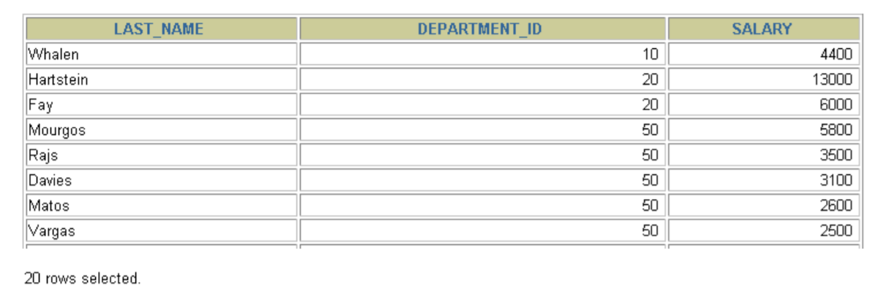

# 第5章 排序与分页

## 1. 排序

### 1.1 排序规则

* 如果没有使用排序操作，默认情况下查询返回的数据是按照添加数据的顺序显示的。
* 使用 ORDER BY 子句排序
  + `SELECT * FROM employees ORDER BY salary;`
  + ASC（ascend）: 升序
  + DESC（descend）:降序
* ORDER BY 子句在SELECT语句的尾部。
* 如果在ORDER BY后没有显式指名排序的方式的话，则默认按照升序排列。

### 1.2 单列排序

```sql
# 按照salary从高到低的顺序显示员工信息
SELECT employee_id, last_name, salary
FROM employees
ORDER BY salary DESC;

# 按照salary从低到高的顺序显示员工信息
SELECT employee_id, last_name, salary
FROM employees
ORDER BY salary ASC;
```

```sql
SELECT last_name, job_id, department_id, hire_date
FROM employees
ORDER BY hire_date ;
```


```sql
SELECT last_name, job_id, department_id, hire_date
FROM employees
ORDER BY hire_date DESC ;
```


可以使用列的别名，进行排序，但列的别名只能在 ORDER BY 中使用，不能在WHERE中使用，否则会报错。

```sql
# 正确的
SELECT employee_id, last_name, salary*12 annsal
FROM employees
ORDER BY annsal;
```
```
#错误的
SELECT employee_id, salary, salary * 12 annual_sal
FROM employees
WHERE annual_sal > 81600;
```


### 1.3 多列排序
```sql
SELECT last_name, department_id, salary
FROM employees
ORDER BY department_id, salary DESC;
```



* 可以使用不在SELECT列表中的列排序。
* 在对多列进行排序的时候，首先排序的第一列必须有相同的列值，才会对第二列进行排序。如果第一列数据中所有值都是唯一的，将不再对第二列进行排序。

## 2. 分页

### 2.1 需求
需求1：查询返回的记录太多了，查看起来很不方便，怎么样能够实现分页查询呢？

需求2：表里有 4 条数据，如果只想要显示第 2、3 条数据怎么办呢？

### 2.2 规则

* 分页原理  
  所谓分页显示，就是将数据库中的结果集，一段一段显示出来需要的条件。
* MySQL中使用 LIMIT 实现分页
* 格式：  
  `SELECT * FROM 表名 LIMIT [位置偏移量,] 行数`  
  第一个“位置偏移量”参数指示MySQL从哪一行开始显示，是一个可选参数，如果不指定“位置偏移量”，将会从表中的第一条记录开始（第一条记录的位置偏移量是0，第二条记录的位置偏移量是1，以此类推）；第二个参数“行数”指示返回的记录条数。

* 举例
```
# 前10条记录：
SELECT * FROM 表名 LIMIT 0,10;
# 或者
SELECT * FROM 表名 LIMIT 10;

# 第11至20条记录：
SELECT * FROM 表名 LIMIT 10,10;

# 第21至30条记录：
SELECT * FROM 表名 LIMIT 20,10;
```
"LIMIT 0,条目数" 等价于 "LIMIT 条目数"

> MySQL 8.0中可以使用“LIMIT 3 OFFSET 4”（3为行数，4为偏移量），意思是获取从第4条记录开始后面的3条记录，和“LIMIT4,3;”返回的结果相同。

* 分页显式公式：（当前页数-1）*每页条数，每页条数
```
SELECT * FROM 表名
LIMIT (PageNo - 1)*PageSize,PageSize;
```
* 注意：LIMIT 子句必须放在整个SELECT语句的最后
* 使用 LIMIT 的好处：  
  约束返回结果的数量可以减少数据表的网络传输量，也可以提升查询效率。如果已知返回结果只有 1 条，就可以使用 LIMIT 1 ，告诉 SELECT 语句只需要返回一条记录即可。这样的好处就是 SELECT 不需要扫描完整的表，只需要检索到一条符合条件的记录即可返回。

### 2.3 拓展
在不同的 DBMS 中使用的关键字可能不同。在 MySQL、PostgreSQL、MariaDB 和 SQLite 中使用 LIMIT 关键字，而且需要放到 SELECT 语句的最后面。

其他数据库中：
* 如果是 SQL Server 和 Access，需要使用`TOP`关键字，比如：
```
SELECT TOP 5 name, hp_max FROM heros ORDER BY hp_max DESC
```

* 如果是 DB2，使用`FETCH FIRST 5 ROWS ONLY`这样的关键字：
```
SELECT name, hp_max FROM heros ORDER BY hp_max DESC FETCH FIRST 5 ROWS ONLY
```

* 如果是 Oracle，需要基于`ROWNUM`来统计行数：
```
SELECT rownum,last_name,salary FROM employees WHERE rownum < 5 ORDER BY salary DESC;
```

## [相关代码](第05章_排序与分页.sql)

## [练习](第5章章节练习.md)