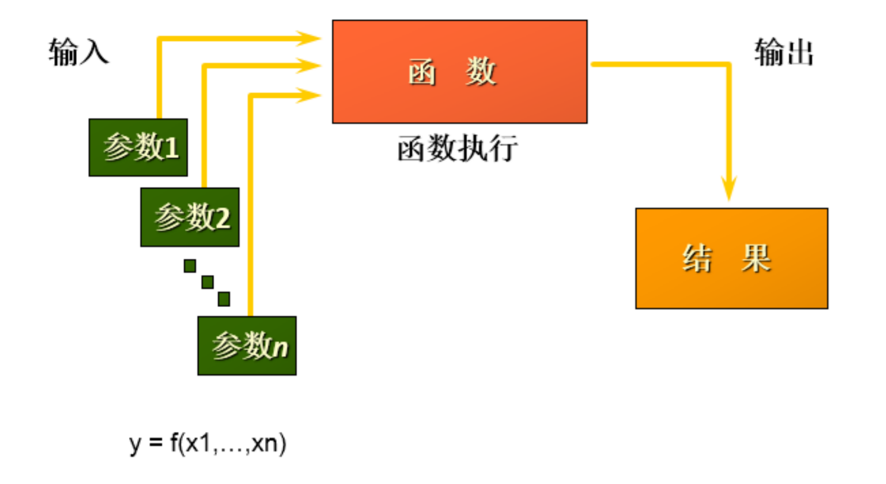
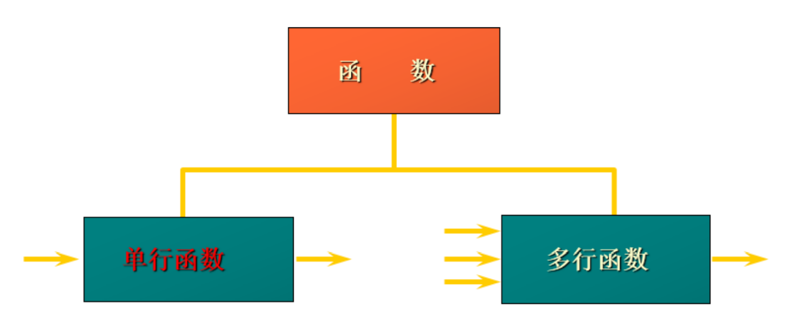

# 第7章 单行函数

## 1. 函数的理解

### 1.1 什么是函数

函数在计算机语言的使用中贯穿始终，函数的作用是什么呢？它可以把我们经常使用的代码封装起来，需要的时候直接调用即可。这样既提高了代码效率，又提高了可维护性。在 SQL 中我们也可以使用函数对检索出来的数据进行函数操作。使用这些函数，可以极大地提高用户对数据库的管理效率 。



从函数定义的角度出发，我们可以将函数分成`内置函数`和`自定义函数`。在 SQL 语言中，同样也包括了内置函数和自定义函数。内置函数是系统内置的通用函数，而自定义函数是我们根据自己的需要编写的，本章及下一章讲解的是 SQL 的内置函数。

### 1.2 不同DBMS函数的差异

我们在使用 SQL 语言的时候，不是直接和这门语言打交道，而是通过它使用不同的数据库软件，即DBMS。**DBMS 之间的差异性很大，远大于同一个语言不同版本之间的差异**。实际上，只有很少的函数是被 DBMS 同时支持的。比如，大多数 DBMS 使用（||）或者（+）来做拼接符，而在 MySQL 中的字符串拼接函数为concat()。大部分 DBMS 会有自己特定的函数，这就意味着**采用 SQL 函数的代码可移植性是很差的**，因此在使用函数的时候需要特别注意。

### 1.3 MySQL的内置函数及分类

MySQL提供了丰富的内置函数，这些函数使得数据的维护与管理更加方便，能够更好地提供数据的分析与统计功能，在一定程度上提高了开发人员进行数据分析与统计的效率。

MySQL提供的内置函数从实现的功能角度可以分为：
* 数值函数
* 字符串函数
* 日期和时间函数
* 流程控制函数
* 加密与解密函数
* 获取MySQL信息函数
* 聚合函数等。

这里，将这些丰富的内置函数再分为两类：
* 单行函数 
* 聚合函数（或分组函数）。

#### 两种SQL函数



#### 单行函数
* 操作数据对象
* 接受参数返回一个结果
* 只对一行进行变换
* 每行返回一个结果
* 可以嵌套
* 参数可以是一列或一个值

## 2. 数值函数

### 2.1 基本函数

|         函数          |                 用法                  |     
|:-------------------:|:-----------------------------------:|
|       ABS(x)        |               返回x的绝对值               |     
|       SIGN(X)       |      返回X的符号。正数返回1，负数返回-1，0返回0       |    
|        PI()         |               返回圆周率的值               |     
| CEIL(x)，CEILING(x)  |           返回大于或等于某个值的最小整数           |     
|      FLOOR(x)       |           返回小于或等于某个值的最大整数           |    
|  LEAST(e1,e2,e3…)   |              返回列表中的最小值              |    
| GREATEST(e1,e2,e3…) |              返回列表中的最大值              |     
|      MOD(x,y)       |             返回X除以Y后的余数              |     
|       RAND()        |              返回0~1的随机值              |     
|       RAND(x)       | 返回0~1的随机值，其中x的值用作种子值，相同的X值会产生相同的随机数 |     
|      ROUND(x)       |      返回一个对x的值进行四舍五入后，最接近于X的整数       |     
|     ROUND(x,y)      |  返回一个对x的值进行四舍五入后最接近X的值，并保留到小数点后面Y位  |     
|    TRUNCATE(x,y)    |           返回数字x截断为y位小数的结果           |     
|       SQRT(x)       |       返回x的平方根。当X的值为负数时，返回NULL       |     

举例： 
```sql
SELECT ABS(-123),ABS(32),SIGN(-23),SIGN(43),PI(),CEIL(32.32),CEILING(-43.23),FLOOR(32.32),FLOOR(-43.23),MOD(12,5)
FROM DUAL;
```
```
+-----------+---------+-----------+----------+----------+-------------+-----------------+--------------+---------------+-----------+
| ABS(-123) | ABS(32) | SIGN(-23) | SIGN(43) | PI()     | CEIL(32.32) | CEILING(-43.23) | FLOOR(32.32) | FLOOR(-43.23) | MOD(12,5) |  
+-----------+---------+-----------+----------+----------+-------------+-----------------+--------------+---------------+-----------+  
|       123 |      32 |        -1 |        1 | 3.141593 |          33 |             -43 |           32 |           -44 |         2 |  
+-----------+---------+-----------+----------+----------+-------------+-----------------+--------------+---------------+-----------+ 
1 row in set (0.00 sec)
```

```sql
SELECT RAND(),RAND(),RAND(10),RAND(10),RAND(-1),RAND(-1)
FROM DUAL;
```

```
+--------------------+---------------------+--------------------+--------------------+--------------------+--------------------+
| RAND()             | RAND()              | RAND(10)           | RAND(10)           | RAND(-1)           | RAND(-1)           |      
+--------------------+---------------------+--------------------+--------------------+--------------------+--------------------+      
| 0.8093661617574898 | 0.21610633024583228 | 0.6570515219653505 | 0.6570515219653505 | 0.9050373219931845 | 0.9050373219931845 |      
+--------------------+---------------------+--------------------+--------------------+--------------------+--------------------+      
1 row in set (0.00 sec)
```

```sql
SELECT ROUND(12.33),ROUND(12.343,2),ROUND(12.324,-1),TRUNCATE(12.66,1),TRUNCATE(12.66,-1)
FROM DUAL;
```

```
+--------------+-----------------+------------------+-------------------+--------------------+
| ROUND(12.33) | ROUND(12.343,2) | ROUND(12.324,-1) | TRUNCATE(12.66,1) | TRUNCATE(12.66,-1) |
+--------------+-----------------+------------------+-------------------+--------------------+
|           12 |           12.34 |               10 |              12.6 |                 10 |
+--------------+-----------------+------------------+-------------------+--------------------+
1 row in set (0.00 sec)
```

### 2.2 角度与弧度互换函数

|     函数     |         用法          |     
|:----------:|:-------------------:|
| RADIANS(x) | 将角度转化为弧度，其中，参数x为角度值 |     
| DEGREES(x) | 将弧度转化为角度，其中，参数x为弧度值 |     

```sql
SELECT RADIANS(30),RADIANS(60),RADIANS(90),DEGREES(2*PI()),DEGREES(RADIANS(90))
FROM DUAL;
```

```
+--------------------+--------------------+--------------------+-----------------+----------------------+
| RADIANS(30)        | RADIANS(60)        | RADIANS(90)        | DEGREES(2*PI()) | DEGREES(RADIANS(90)) |
+--------------------+--------------------+--------------------+-----------------+----------------------+
| 0.5235987755982988 | 1.0471975511965976 | 1.5707963267948966 |             360 |                   90 |
+--------------------+--------------------+--------------------+-----------------+----------------------+
1 row in set (0.00 sec)
```

### 2.3 三角函数

|     函数     |                    用法                    |
|:----------:|:----------------------------------------:|
|   SIN(x)   |            返回x的正弦值，其中，参数x为弧度值            |
|  ASIN(x)   | 返回x的反正弦值，即获取正弦为x的值。如果x的值不在-1到1之间，则返回NULL |
|   COS(x)   |            返回x的余弦值，其中，参数x为弧度值            |
|  ACOS(x)   | 返回x的反余弦值，即获取余弦为x的值。如果x的值不在-1到1之间，则返回NULL |
|   TAN(x)   |            返回x的正切值，其中，参数x为弧度值            |
|  ATAN(x)   |           返回x的反正切值，即返回正切值为x的值            |
| ATAN2(m,n) |               返回两个参数的反正切值                |
|   COT(x)   |             返回x的余切值，其中，X为弧度值             |

举例：  
ATAN2(M,N)函数返回两个参数的反正切值。与ATAN(X)函数相比，ATAN2(M,N)需要两个参数，例如有两个点point(x1,y1)和point(x2,y2)，使用ATAN(X)函数计算反正切值为ATAN((y2-y1)/(x2-x1))，使用ATAN2(M,N)计算反正切值则为ATAN2(y2-y1,x2-x1)。由使用方式可以看出，当x2-x1等于0时，ATAN(X)函数会报错，而ATAN2(M,N)函数则仍然可以计算。

ATAN2(M,N)函数的使用示例如下：

```sql
SELECT SIN(RADIANS(30)),DEGREES(ASIN(1)),TAN(RADIANS(45)),DEGREES(ATAN(1)),DEGREES(ATAN2(1,1))
FROM DUAL;
```

```
+---------------------+------------------+--------------------+------------------+---------------------+
| SIN(RADIANS(30))    | DEGREES(ASIN(1)) | TAN(RADIANS(45))   | DEGREES(ATAN(1)) | DEGREES(ATAN2(1,1)) |
+---------------------+------------------+--------------------+------------------+---------------------+
| 0.49999999999999994 |               90 | 0.9999999999999999 |               45 |                  45 |
+---------------------+------------------+--------------------+------------------+---------------------+
1 row in set (0.00 sec)
```

### 2.4 指数与对数

|         函数          |                 用法                 |
|:-------------------:|:----------------------------------:|
| POW(x,y)，POWER(X,Y) |              返回x的y次方               |
|       EXP(X)        | 返回e的X次方，其中e是一个常数，2.718281828459045 |
|    LN(X)，LOG(X)     |  返回以e为底的X的对数，当X <= 0 时，返回的结果为NULL  |
|      LOG10(X)       | 返回以10为底的X的对数，当X <= 0 时，返回的结果为NULL  |
|       LOG2(X)       |    返回以2为底的X的对数，当X <= 0 时，返回NULL    |

```sql
SELECT POW(2,5),POWER(2,4),EXP(2),LN(10),LOG10(10),LOG2(4)
FROM DUAL;
```

```
+----------+------------+------------------+-------------------+-----------+---------+
| POW(2,5) | POWER(2,4) | EXP(2)           | LN(10)            | LOG10(10) | LOG2(4) |
+----------+------------+------------------+-------------------+-----------+---------+
|       32 |         16 | 7.38905609893065 | 2.302585092994046 |         1 |       2 |
+----------+------------+------------------+-------------------+-----------+---------+
1 row in set (0.00 sec)
```

### 2.5 进制间的转换

|      函数       |       用法       |
|:-------------:|:--------------:|
|    BIN(x)     |   返回x的二进制编码    |
|    HEX(x)     |   返回x的十六进制编码   |
|    OCT(x)     |   返回x的八进制编码    |
| CONV(x,f1,f2) | 返回f1进制数变成f2进制数 |

```sql
SELECT BIN(10),HEX(10),OCT(10),CONV(10,2,8)
FROM DUAL;
```

```
+---------+---------+---------+--------------+
| BIN(10) | HEX(10) | OCT(10) | CONV(10,2,8) |
+---------+---------+---------+--------------+
| 1010    | A       | 12      | 2            |
+---------+---------+---------+--------------+
1 row in set (0.00 sec)
```

## 3. 字符串函数

|                函数                 |                                        用法                                         |
|:---------------------------------:|:---------------------------------------------------------------------------------:|
|             ASCII(S)              |                               返回字符串S中的第一个字符的ASCII码值                               |
|          CHAR_LENGTH(s)           |                        返回字符串s的字符数。作用与CHARACTER_LENGTH(s)相同                        |
|             LENGTH(s)             |                                 返回字符串s的字节数，和字符集有关                                 |
|      CONCAT(s1,s2,......,sn)      |                              连接s1,s2,......,sn为一个字符串                              |
|   CONCAT_WS(x,s1,s2,......,sn)    |                        同CONCAT(s1,s2,...)函数，但是每个字符串之间要加上x                         |
| INSERT(str, idx, len, replacestr) |                    将字符串str从第idx位置开始，len个字符长的子串替换为字符串replacestr                    |
|        REPLACE(str, a, b)         |                              用字符串b替换字符串str中所有出现的字符串a                              |
|        UPPER(s) 或 UCASE(s)        |                                 将字符串s的所有字母转成大写字母                                  |
|        LOWER(s) 或LCASE(s)         |                                 将字符串s的所有字母转成小写字母                                  |
|            LEFT(str,n)            |                                 返回字符串str最左边的n个字符                                  |
|           RIGHT(str,n)            |                                 返回字符串str最右边的n个字符                                  |
|        LPAD(str, len, pad)        |                        用字符串pad对str最左边进行填充，直到str的长度为len个字符                         |
|        RPAD(str ,len, pad)        |                        用字符串pad对str最右边进行填充，直到str的长度为len个字符                         |
|             LTRIM(s)              |                                    去掉字符串s左侧的空格                                    |
|             RTRIM(s)              |                                    去掉字符串s右侧的空格                                    |
|              TRIM(s)              |                                  去掉字符串s开始与结尾的空格                                   |
|          TRIM(s1 FROM s)          |                                  去掉字符串s开始与结尾的s1                                   |
|      TRIM(LEADING s1 FROM s)      |                                   去掉字符串s开始处的s1                                    |
|     TRIM(TRAILING s1 FROM s)      |                                   去掉字符串s结尾处的s1                                    |
|          REPEAT(str, n)           |                                   返回str重复n次的结果                                    |
|             SPACE(n)              |                                      返回n个空格                                       |
|           STRCMP(s1,s2)           |                               比较字符串s1,s2的ASCII码值的大小                               |
|        SUBSTR(s,index,len)        |            返回从字符串s的index位置其len个字符，作用与SUBSTRING(s,n,len)、MID(s,n,len)相同            |
|        LOCATE(substr,str)         | 返回字符串substr在字符串str中首次出现的位置，作用于POSITION(substr IN str)、INSTR(str,substr)相同。未找到，返回0 |
|         ELT(m,s1,s2,…,sn)         |                  返回指定位置的字符串，如果m=1，则返回s1，如果m=2，则返回s2，如果m=n，则返回sn                   |
|        FIELD(s,s1,s2,…,sn)        |                               返回字符串s在字符串列表中第一次出现的位置                               |
|        FIND_IN_SET(s1,s2)         |                     返回字符串s1在字符串s2中出现的位置。其中，字符串s2是一个以逗号分隔的字符串                      |
|            REVERSE(s)             |                                    返回s反转后的字符串                                     |
|       NULLIF(value1,value2)       |                   比较两个字符串，如果value1与value2相等，则返回NULL，否则返回value1                    |

> 注意：MySQL中，字符串的位置是从1开始的。


