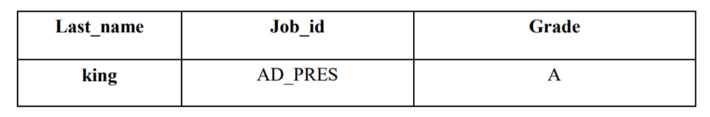

# 第7章章节练习

```
【题目】

# 1.显示系统时间(注：日期+时间)

# 2.查询员工号，姓名，工资，以及工资提高百分之20%后的结果（new salary）

# 3.将员工的姓名按首字母排序，并写出姓名的长度（length）

# 4.查询员工id,last_name,salary，并作为一个列输出，别名为OUT_PUT

# 5.查询公司各员工工作的年数、工作的天数，并按工作年数的降序排序

# 6.查询员工姓名，hire_date , department_id，满足以下条件：雇用时间在1997年之后，department_id为80 或 90 或110, commission_pct不为空

# 7.查询公司中入职超过10000天的员工姓名、入职时间

# 8.做一个查询，产生下面的结果
<last_name> earns <salary> monthly but wants <salary*3>
```


```
# 9.使用case-when，按照下面的条件：
job         grade
AD_PRES     A
ST_MAN      B
IT_PROG     C
SA_REP      D
ST_CLERK    E
产生下面的结果:
```



### 1.显示系统时间(注：日期+时间)

```sql
SELECT NOW()
FROM DUAL;
```

### 2.查询员工号，姓名，工资，以及工资提高百分之20%后的结果（new salary）

```sql
SELECT employee_id, last_name, salary, salary * 1.2 "new salary"
FROM employees;
```

### 3.将员工的姓名按首字母排序，并写出姓名的长度（length）

```sql
SELECT last_name, LENGTH(last_name)
FROM employees
ORDER BY last_name DESC;
```

### 4.查询员工id,last_name,salary，并作为一个列输出，别名为OUT_PUT

```sql
SELECT CONCAT(employee_id, ',' , last_name , ',', salary) OUT_PUT
FROM employees;
```

### 5.查询公司各员工工作的年数、工作的天数，并按工作年数的降序排序。

SELECT DATEDIFF(SYSDATE(), hire_date) / 365 worked_years, DATEDIFF(SYSDATE(), hire_date) worked_days
FROM employees
ORDER BY worked_years DESC

### 6.查询员工姓名，hire_date , department_id，满足以下条件：雇用时间在1997年之后，department_id 为80 或 90 或110, commission_pct不为空

```sql
SELECT last_name, hire_date, department_id
FROM employees
# WHERE hire_date >= '1997-01-01'
# WHERE hire_date >= STR_TO_DATE('1997-01-01', '%Y-%m-%d')
WHERE DATE_FORMAT(hire_date,'%Y') >= '1997'
AND department_id IN (80, 90, 110)
AND commission_pct IS NOT NULL
```

### 7.查询公司中入职超过10000天的员工姓名、入职时间

```sql
SELECT last_name,hire_date
FROM employees
# WHERE TO_DAYS(NOW()) - to_days(hire_date) > 10000;
WHERE DATEDIFF(NOW(),hire_date) > 10000;
```

### 8.做一个查询，产生下面的结果

```
-- <last_name> earns `<salary>` monthly but wants <salary*3>
-- Dream Salary
-- King earns 24000 monthly but wants 72000
```

```sql
SELECT CONCAT(last_name, ' earns ', TRUNCATE(salary, 0) , ' monthly but wants ',
TRUNCATE(salary * 3, 0)) "Dream Salary"
FROM employees;
```

### 9.使用CASE-WHEN，按照下面的条件：

```sql
-- job      grade
-- AD_PRES  A
-- ST_MAN   B
-- IT_PROG  C
-- SA_REP   D
-- ST_CLERK E

-- 产生下面的结果
-- Last_name    Job_id      Grade
-- king         AD_PRES     A
```

```sql
SELECT last_name Last_name, job_id Job_id, CASE job_id WHEN 'AD_PRES' THEN 'A'
WHEN 'ST_MAN' THEN 'B'
WHEN 'IT_PROG' THEN 'C'
WHEN 'SA_REP' THEN 'D'
WHEN 'ST_CLERK' THEN 'E'
ELSE 'F'
END "grade"
FROM employees;
```

## [相关代码](第07章_单行函数的课后练习.sql)