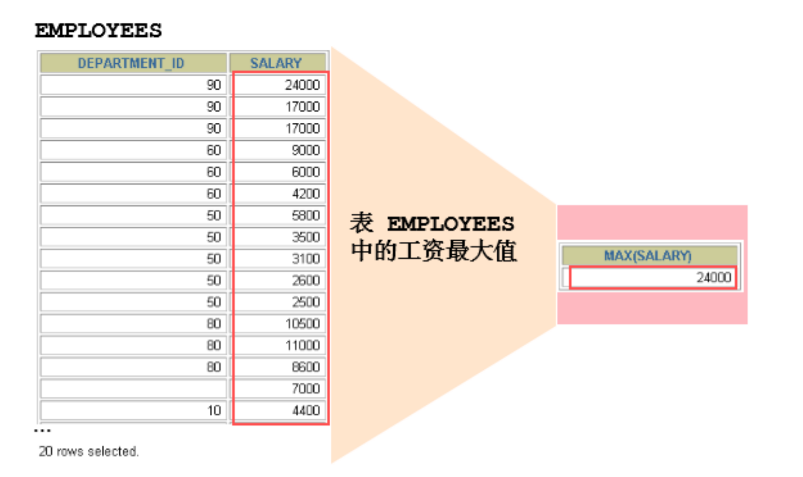
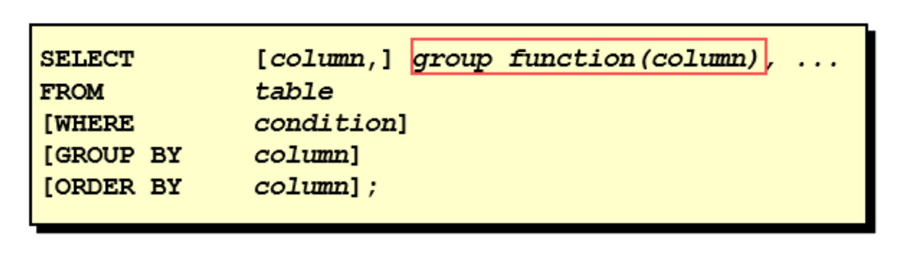
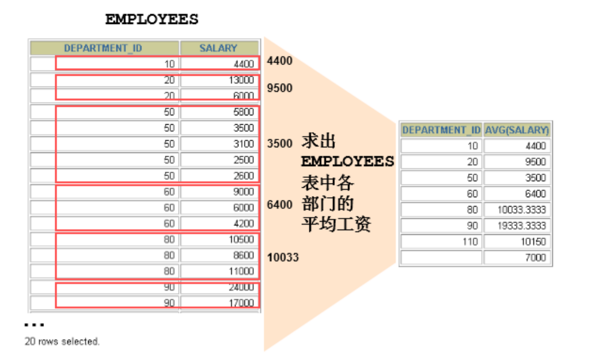

# 第8章 聚合函数

上一章讲到了 SQL 单行函数。实际上 SQL 函数还有一类，叫做聚合（或聚集、分组）函数，它是对一组数据进行汇总的函数，输入的是一组数据的集合，输出的是单个值。

## 1. 聚合函数介绍

#### 什么是聚合函数

聚合函数作用于一组数据，并对一组数据返回一个值。



#### 聚合函数类型

* AVG()
* SUM()
* MAX()
* MIN()
* COUNT()

#### 聚合函数语法



聚合函数不能嵌套调用。比如不能出现类似“AVG(SUM(字段名称))”形式的调用。

### 1.1 AVG和SUM函数

可以对数值型数据使用AVG 和 SUM 函数（不计算null值）。

```sql
SELECT AVG(salary), MAX(salary),MIN(salary), SUM(salary)
FROM employees
WHERE job_id LIKE '%REP%';
```

```
+-------------+-------------+-------------+-------------+
| AVG(salary) | MAX(salary) | MIN(salary) | SUM(salary) |
+-------------+-------------+-------------+-------------+
| 8272.727273 |    11500.00 |     6000.00 |   273000.00 |
+-------------+-------------+-------------+-------------+
1 row in set (0.00 sec)
```

注意：

```sql
# 如下的操作没有意义
SELECT SUM(last_name), AVG(last_name), SUM(hire_date)
FROM employees;
```

### 1.2 MIN和MAX函数

```sql
SELECT MIN(hire_date), MAX(hire_date)
FROM employees;
```

```
+----------------+----------------+
| MIN(hire_date) | MAX(hire_date) |
+----------------+----------------+
| 1987-06-17     | 2000-04-21     |
+----------------+----------------+
1 row in set (0.00 sec)
```

### 1.3 COUNT函数

* COUNT(*)返回表中记录总数，适用于任意数据类型。

```sql
SELECT COUNT(*)
FROM employees
WHERE department_id = 50;
```

```
+----------+
| COUNT(*) |
+----------+
|       45 |
+----------+
1 row in set (0.00 sec)
```

* COUNT(expr) 返回expr不为空的记录总数。

```sql
SELECT COUNT(commission_pct)
FROM employees
WHERE department_id = 50;
```

```
+-----------------------+
| COUNT(commission_pct) |
+-----------------------+
|                     0 |
+-----------------------+
1 row in set (0.00 sec)
```

* 问题：用count(\*)，count(1)，count(列名)谁好呢?  
  其实，对于MyISAM引擎的表是没有区别的。这种引擎内部有一计数器在维护着行数。  
  Innodb引擎的表用count(*),count(1)直接读行数，复杂度是O(n)，因为innodb真的要去数一遍。但好于具体的count(列名)。

* 问题：能不能使用count(列名)替换count(\*)?  
  不要使用 count(列名)来替代 count(\*) ，count(*) 是 SQL92 定义的标准统计行数的语法，跟数据库无关，跟 NULL 和非 NULL 无关。  
  说明：count(\*)会统计值为 NULL 的行，而 count(列名)不会统计此列为 NULL 值的行。

```sql
# 需求：查询公司平均奖金率
# 错误的！因为commission_pct字段可能为空，计算公司平均中奖率时应该算上没有奖金的人，除非特别指明有奖金的员工的平均奖金率是多少
SELECT AVG(commission_pct)
FROM employees;

# 正确的：
SELECT SUM(commission_pct) / COUNT(IFNULL(commission_pct, 0)),
       AVG(IFNULL(commission_pct, 0))
FROM employees;
```

## 2. GROUP BY

### 2.1 基本使用



可以使用GROUP BY子句将表中的数据分成若干组

```
SELECT column, group_function(column)
FROM table
[WHERE condition]
[GROUP BY group_by_expression]
[ORDER BY column];

```

> 明确：WHERE一定放在FROM后面

在SELECT列表中所有未包含在组函数中的列都应该包含在 GROUP BY子句中

```sql
SELECT department_id, AVG(salary)
FROM employees
GROUP BY department_id;
```

```
+---------------+--------------+
| department_id | AVG(salary)  |
+---------------+--------------+
|          NULL |  7000.000000 |
|            10 |  4400.000000 |
|            20 |  9500.000000 |
|            30 |  4150.000000 |
|            40 |  6500.000000 |
|            50 |  3475.555556 |
|            60 |  5760.000000 |
|            70 | 10000.000000 |
|            80 |  8955.882353 |
|            90 | 19333.333333 |
|           100 |  8600.000000 |
|           110 | 10150.000000 |
+---------------+--------------+
12 rows in set (0.00 sec)
```

包含在 GROUP BY 子句中的列不必包含在SELECT 列表中

```sql
SELECT AVG(salary)
FROM employees
GROUP BY department_id;
```

```
+--------------+
| AVG(salary)  |
+--------------+
|  7000.000000 |
|  4400.000000 |
|  9500.000000 |
|  4150.000000 |
|  6500.000000 |
|  3475.555556 |
|  5760.000000 |
| 10000.000000 |
|  8955.882353 |
| 19333.333333 |
|  8600.000000 |
| 10150.000000 |
+--------------+
12 rows in set (0.00 sec)
```

### 2.2 使用多个列分组


