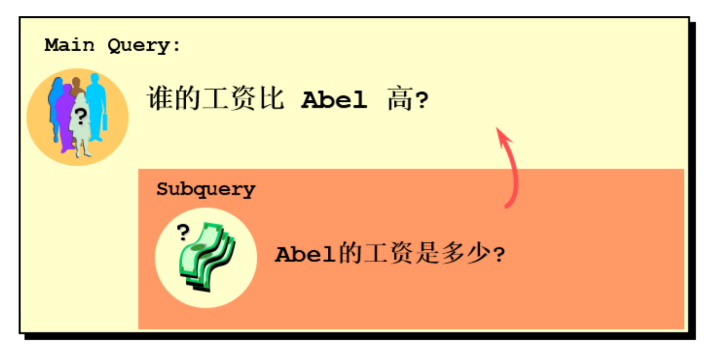
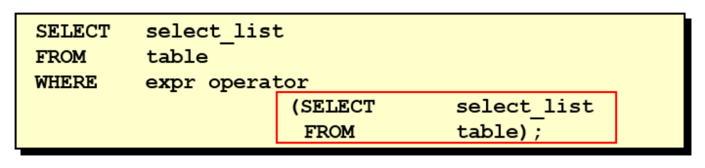
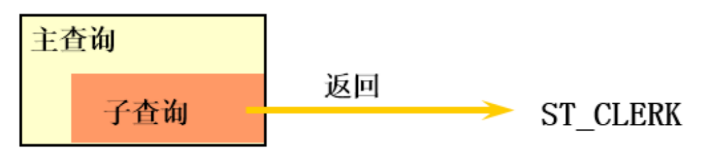
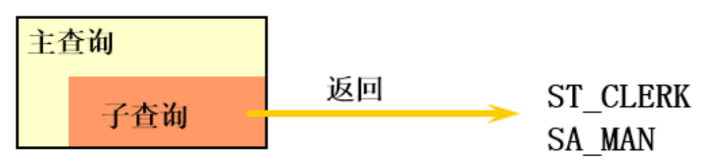
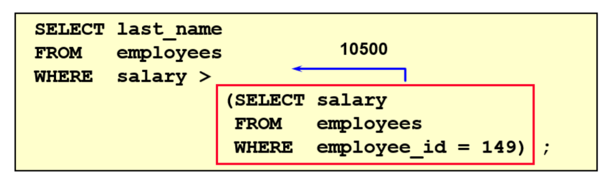

# 第9章 子查询

子查询指一个查询语句嵌套在另一个查询语句内部的查询，这个特性从MySQL 4.1开始引入。

SQL 中子查询的使用大大增强了 SELECT 查询的能力，因为很多时候查询需要从结果集中获取数据，或者需要从同一个表中先计算得出一个数据结果，然后与这个数据结果（可能是某个标量，也可能是某个集合）进行比较。

## 1. 需求分析与问题解决

### 1.1 实际问题 

查询出比 Abel 工资高的员工的信息



现有解决方式：

```sql
#方式一：
SELECT salary
FROM employees
WHERE last_name = 'Abel';

SELECT last_name,salary
FROM employees
WHERE salary > 11000;

#方式二：自连接
SELECT e2.last_name,e2.salary
FROM employees e1,employees e2
WHERE e1.last_name = 'Abel'
AND e1.`salary` < e2.`salary`;

#方式三：子查询
SELECT last_name,salary
FROM employees
WHERE salary > (
    SELECT salary
    FROM employees
    WHERE last_name = 'Abel'
);
```

```
+-----------+----------+
| last_name | salary   |
+-----------+----------+
| King      | 24000.00 |
| Kochhar   | 17000.00 |
| De Haan   | 17000.00 |
| Greenberg | 12000.00 |
| Russell   | 14000.00 |
| Partners  | 13500.00 |
| Errazuriz | 12000.00 |
| Ozer      | 11500.00 |
| Hartstein | 13000.00 |
| Higgins   | 12000.00 |
+-----------+----------+
10 rows in set (0.00 sec)
```

### 1.2 子查询的基本使用

* 子查询的基本语法结构：



* 子查询（内查询）在主查询之前一次执行完成
* 子查询的结果被主查询（外查询）使用
* 注意事项
  - 子查询要包含在括号内
  - 将子查询放在比较条件的右侧
  - 单行操作符对应单行子查询，多行操作符对应多行子查询

### 1.3 子查询的分类

分类方式1：

我们按内查询的结果返回一条还是多条记录，将子查询分为`单行子查询`、`多行子查询`。

* 单行子查询



* 多行子查询



分类方式2：

我们按内查询是否被执行多次，将子查询划分为`相关(或关联)子查询`和`不相关(或非关联)子查询`。

子查询从数据表中查询了数据结果，如果这个数据结果只执行一次，然后这个数据结果作为主查询的条件进行执行，那么这样的子查询叫做不相关子查询。

同样，如果子查询需要执行多次，即采用循环的方式，先从外部查询开始，每次都传入子查询进行查询，然后再将结果反馈给外部，这种嵌套的执行方式就称为相关子查询。

比如：
* 相关子查询的需求：查询工资大于本部门平均工资的员工信息。
* 不相关子查询的需求：查询工资大于本公司平均工资的员工信息。

## 2. 单行子查询

### 2.1 单行比较操作符

| 操作符 |            含义            |
|:---:|:------------------------:|
|  =  |         equal to         |
| \>  |       greater than       |
| \>= | greater than or equal to |
|  <  |        less than         |
| <=  |  less than or equal to   |
| <>  |       not equal to       |

### 2.2 代码示例

### 题目：查询工资大于149号员工工资的员工的信息



```sql
SELECT employee_id, last_name, salary
FROM employees
WHERE salary > (
    SELECT salary
    FROM employees
    WHERE employee_id = 149
);
```

```
+-------------+-----------+----------+
| employee_id | last_name | salary   |
+-------------+-----------+----------+
|         100 | King      | 24000.00 |
|         101 | Kochhar   | 17000.00 |
|         102 | De Haan   | 17000.00 |
|         108 | Greenberg | 12000.00 |
|         114 | Raphaely  | 11000.00 |
|         145 | Russell   | 14000.00 |
|         146 | Partners  | 13500.00 |
|         147 | Errazuriz | 12000.00 |
|         148 | Cambrault | 11000.00 |
|         168 | Ozer      | 11500.00 |
|         174 | Abel      | 11000.00 |
|         201 | Hartstein | 13000.00 |
|         205 | Higgins   | 12000.00 |
+-------------+-----------+----------+
13 rows in set (0.00 sec)
```

#### 题目：返回job_id与141号员工相同，salary比143号员工多的员工姓名，job_id和工资

```sql
SELECT last_name, job_id, salary
FROM employees
WHERE job_id = (
    SELECT job_id
    FROM employees
    WHERE employee_id = 141
)
  AND salary > (
    SELECT salary
    FROM employees
    WHERE employee_id = 143
);
```

```
+-------------+----------+---------+
| last_name   | job_id   | salary  |
+-------------+----------+---------+
| Nayer       | ST_CLERK | 3200.00 |
| Mikkilineni | ST_CLERK | 2700.00 |
| Bissot      | ST_CLERK | 3300.00 |
| Atkinson    | ST_CLERK | 2800.00 |
| Mallin      | ST_CLERK | 3300.00 |
| Rogers      | ST_CLERK | 2900.00 |
| Ladwig      | ST_CLERK | 3600.00 |
| Stiles      | ST_CLERK | 3200.00 |
| Seo         | ST_CLERK | 2700.00 |
| Rajs        | ST_CLERK | 3500.00 |
| Davies      | ST_CLERK | 3100.00 |
+-------------+----------+---------+
11 rows in set (0.00 sec)
```

#### 题目：返回公司工资最少的员工的last_name,job_id和salary

```sql
SELECT last_name, job_id, salary
FROM employees
WHERE salary = (
    SELECT MIN(salary)
    FROM employees
);
```

```
+-----------+----------+---------+
| last_name | job_id   | salary  |
+-----------+----------+---------+
| Olson     | ST_CLERK | 2100.00 |
+-----------+----------+---------+
1 row in set (0.00 sec)
```

#### 题目：查询与141号员工的manager_id和department_id相同的其他员工的employee_id，manager_id，department_id。

```sql
#方式1：
SELECT employee_id, manager_id, department_id
FROM employees
WHERE manager_id = (
    SELECT manager_id
    FROM employees
    WHERE employee_id = 141
)
  AND department_id = (
    SELECT department_id
    FROM employees
    WHERE employee_id = 141
)
  AND employee_id <> 141;

#方式2：了解
SELECT employee_id, manager_id, department_id
FROM employees
WHERE (manager_id, department_id) = (
    SELECT manager_id, department_id
    FROM employees
    WHERE employee_id = 141
)
  AND employee_id <> 141;
```

```
+-------------+------------+---------------+
| employee_id | manager_id | department_id |
+-------------+------------+---------------+
|         142 |        124 |            50 |
|         143 |        124 |            50 |
|         144 |        124 |            50 |
|         196 |        124 |            50 |
|         197 |        124 |            50 |
|         198 |        124 |            50 |
|         199 |        124 |            50 |
+-------------+------------+---------------+
7 rows in set (0.00 sec)
```

### 2.3 HAVING 中的子查询

* 首先执行子查询。
* 向主查询中的HAVING 子句返回结果。

#### 题目：查询最低工资大于110号部门最低工资的部门id和其最低工资

```sql
SELECT department_id, MIN(salary)
FROM employees
WHERE department_id IS NOT NULL
GROUP BY department_id
HAVING MIN(salary) > (
    SELECT MIN(salary)
    FROM employees
    WHERE department_id = 110
);
```

```
+---------------+-------------+
| department_id | MIN(salary) |
+---------------+-------------+
|            70 |    10000.00 |
|            90 |    17000.00 |
+---------------+-------------+
2 rows in set (0.00 sec)
```

### 2.4 CASE中的子查询

可以在CASE表达式中使用单列子查询

### 题目：显示员工的employee_id,last_name和location。其中，若员工department_id与location_id为1800的department_id相同，则location为’Canada’，其余则为’USA’。

```sql
SELECT employee_id,
       last_name,
       CASE department_id
           WHEN (SELECT department_id FROM departments WHERE location_id = 1800) THEN 'Canada'
           ELSE 'USA' END "location"
FROM employees;
```

```
+-------------+-------------+----------+
| employee_id | last_name   | location |
+-------------+-------------+----------+
|         100 | King        | USA      |
|         101 | Kochhar     | USA      |
|         102 | De Haan     | USA      |
|         103 | Hunold      | USA      |
...
107 rows in set (0.00 sec)
```

### 2.5 子查询中的空值问题

```sql
SELECT last_name, job_id
FROM employees
WHERE job_id =
      (SELECT job_id
       FROM employees
       WHERE last_name = 'Haas');
```

```
Empty set (0.00 sec)
```

```sql
# 该SQL语句无查询出来的结果，所以上面的SQL也没有查询出来的结果
SELECT job_id
       FROM employees
       WHERE last_name = 'Haas';
```

> 子查询不返回任何空行

### 2.5 非法使用子查询

```sql
SELECT employee_id, last_name
FROM employees
WHERE salary =
      (SELECT MIN(salary)
       FROM employees
       GROUP BY department_id);
```

```
ERROR 1242 (21000): Subquery returns more than 1 row
```

```sql
SELECT MIN(salary)
       FROM employees
       GROUP BY department_id;
# 上面这条SQL查询出了多个值，而在主查询中使用'='，查询就会报错       
```

> 多行子查询不能使用单行比较符

## 3. 多行子查询

* 也称为集合比较子查询
* 内查询返回多行
* 使用多行比较操作符

### 3.1 多行比较操作符

| 操作符  |              含义              |
|:----:|:----------------------------:|
|  IN  |          等于列表中的任意一个          |
| ANY  | 需要和单行比较操作符一起使用，和子查询返回的某一个值比较 |
| ALL  | 需要和单行比较操作符一起使用，和子查询返回的所有值比较  |
| SOME |   实际上是ANY的别名，作用相同，一般常使用ANY   |

> 体会 ANY 和 ALL 的区别

### 3.2 代码示例

#### 题目：返回各个部门工资最低的employee_id和last_name

```sql
# IN:
SELECT employee_id, last_name
FROM employees
WHERE salary IN
      (SELECT MIN(salary)
       FROM employees
       GROUP BY department_id);
```

#### 题目：返回其它job_id中比job_id为‘IT_PROG’部门任一工资低的员工的员工号、姓名、job_id 以及salary

```sql
# ANY
SELECT employee_id, last_name, job_id, salary
FROM employees
WHERE job_id <> 'IT_PROG'
  AND salary < ANY (
    SELECT salary
    FROM employees
    WHERE job_id = 'IT_PROG'
);
```

#### 题目：返回其它job_id中比job_id为‘IT_PROG’部门所有工资低的员工的员工号、姓名、job_id 以及salary

```sql
# ALL
SELECT employee_id, last_name, job_id, salary
FROM employees
WHERE job_id <> 'IT_PROG'
  AND salary < ALL (
    SELECT salary
    FROM employees
    WHERE job_id = 'IT_PROG'
);
```

#### 题目：查询平均工资最低的部门id

```sql
# MySQL中聚合函数是不能嵌套使用的。
# 方式1：
SELECT department_id
FROM employees
GROUP BY department_id
HAVING AVG(salary) = (
    SELECT MIN(avg_sal)
    FROM (
             SELECT AVG(salary) avg_sal
             FROM employees
             GROUP BY department_id
         ) t_dept_avg_sal
);

# 方式2：
SELECT department_id
FROM employees
GROUP BY department_id
HAVING AVG(salary) <= ALL (
    SELECT AVG(salary) avg_sal
    FROM employees
    GROUP BY department_id
);
```


