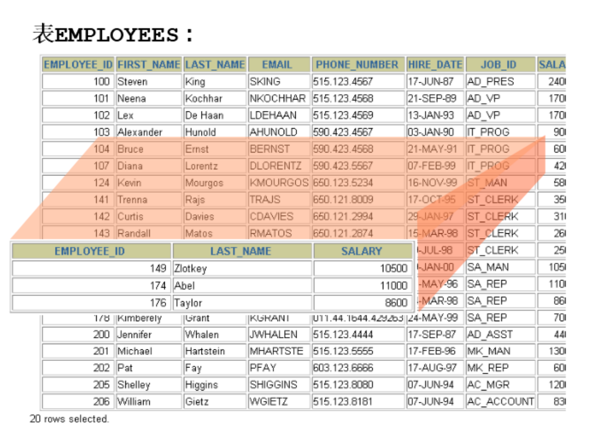
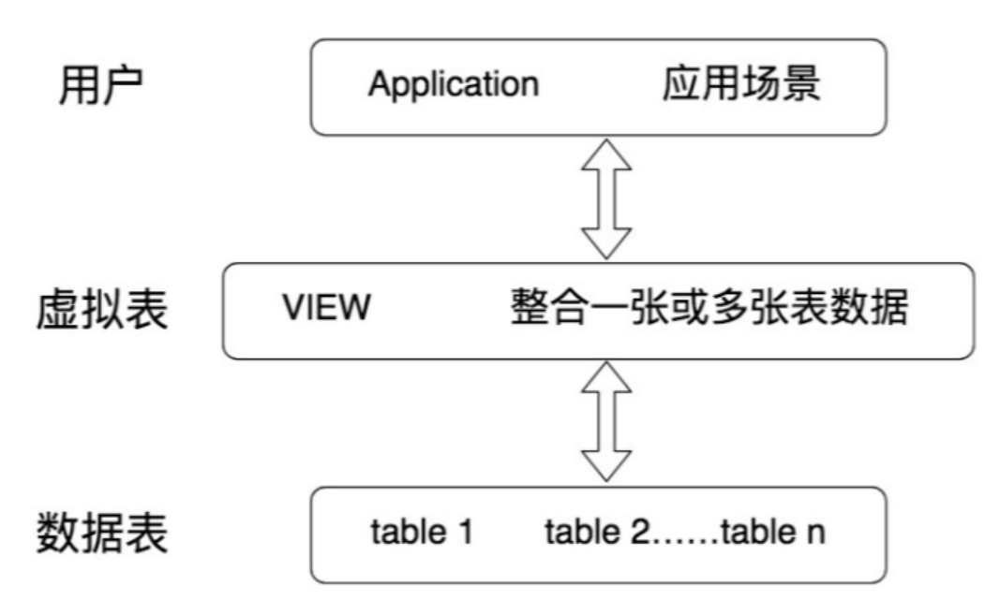
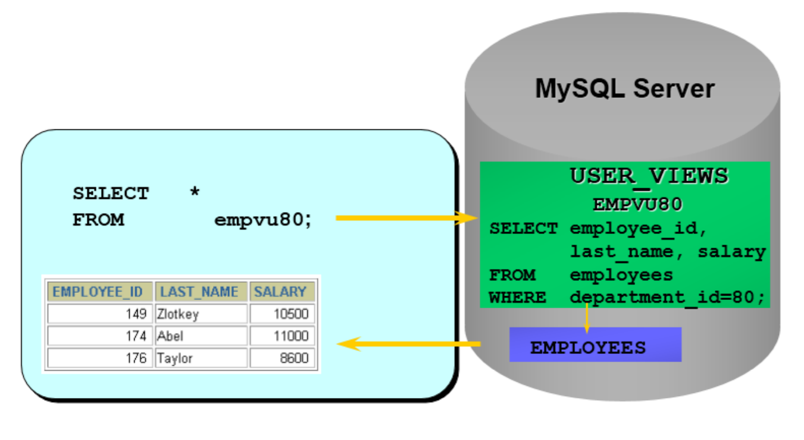

# 第14章 视图

## 1. 常见的数据库对象

|        对象        |                         描述                          |
|:----------------:|:---------------------------------------------------:|
|     表(TABLE)     |          表是存储数据的逻辑单元，以行和列的形式存在，列就是字段，行就是记录          |
|       数据字典       | 就是系统表，存放数据库相关信息的表。系统表的数据通常由数据库系统维护，程序员通常不应该修改，只可查看  |
|  约束(CONSTRAINT)  |               执行数据校验的规则，用于保证数据完整性的规则                |
|     视图(VIEW)     |             一个或者多个数据表里的数据的逻辑显示，视图并不存储数据             |
|    索引(INDEX)     |                  用于提高查询性能，相当于书的目录                   |
| 存储过程(PROCEDURE)  |       用于完成一次完整的业务处理，没有返回值，但可通过传出参数将多个值传给调用环境        |
|  存储函数(FUNCTION)  |                 用于完成一次特定的计算，具有一个返回值                 |
|   触发器(TRIGGER)   |        相当于一个事件监听器，当数据库发生特定事件后，触发器被触发，完成相应的处理        |

## 2. 视图概述

视图是一个虚拟表，是对原表数据的折射



### 2.1 为什么使用视图？

视图一方面可以使用表的一部分而不是所有的表，另一方面也可以针对不同的用户制定不同的查询视图。比如，针对一个公司的销售人员，只想给他看部分数据，而某些特殊的数据，比如采购的价格，则不会提供给他。再比如，人员薪酬是个敏感的字段，那么只给某个级别以上的人员开放，其他人的查询视图中则不提供这个字段。

刚才讲的只是视图的一个使用场景，实际上视图还有很多作用。在最后将总结视图的优点。

### 2.2 视图的理解

* 视图是一种`虚拟表`，本身是`不具有数据`的，占用很少的内存空间，它是 SQL 中的一个重要概念。
* 视图建立在已有表的基础上, 视图赖以建立的这些表称为基表。



* 视图的创建和删除只影响视图本身，不影响对应的基表。但是当对视图中的数据进行增加、删除和修改操作时，数据表中的数据会相应地发生变化，反之（操作原表的数据增删改）亦然。
* 向视图提供数据内容的语句为 SELECT 语句, 可以将视图理解为存储起来的 SELECT 语句
  - 在数据库中，视图不会保存数据，数据真正保存在数据表中。当对视图中的数据进行增加、删除和修改操作时，数据表中的数据会相应地发生变化；反之亦然。
* 视图，是向用户提供基表数据的另一种表现形式。通常情况下，小型项目的数据库可以不使用视图，但是在大型项目中，以及数据表比较复杂的情况下，视图的价值就凸显出来了，它可以帮助我们把经常查询的结果集放到虚拟表中，提升使用效率。理解和使用起来都非常方便。

## 3. 创建视图

* 在 CREATE VIEW 语句中嵌入子查询

```sql
CREATE [OR REPLACE]
[ALGORITHM = {UNDEFINED | MERGE | TEMPTABLE}]
VIEW 视图名称 [(字段列表)]
AS 查询语句
[WITH [CASCADED|LOCAL] CHECK OPTION]
```

* 精简版

```sql
CREATE VIEW 视图名称
AS 查询语句
```

### 3.1 创建单表视图

举例：

```sql
CREATE VIEW empvu80
AS
SELECT employee_id, last_name, salary
FROM employees
WHERE department_id = 80;
```

如果employees在其他数据库中，可以使用`数据库.employees`取到数据

查询视图：

```sql
SELECT *
FROM salvu80;
```



举例：

```sql
CREATE VIEW emp_year_salary (ename, year_salary)
AS
SELECT ename, salary * 12 * (1 + IFNULL(commission_pct, 0))
FROM t_employee;
```

举例：

```sql
CREATE VIEW salvu50
AS
SELECT employee_id ID_NUMBER, last_name NAME, salary * 12 ANN_SALARY
FROM employees
WHERE department_id = 50;
```

* 说明1：实际上就是我们在 SQL 查询语句的基础上封装了视图 VIEW，这样就会基于 SQL 语句的结果集形成一张虚拟表。
* 说明2：在创建视图时，没有在视图名后面指定字段列表，则视图中字段列表默认和SELECT语句中的字段列表一致。如果SELECT语句中给字段取了别名，那么视图中的字段名和别名相同。

### 3.2 创建多表联合视图

举例：

```sql
CREATE VIEW empview
AS
SELECT employee_id emp_id, last_name NAME, department_name
FROM employees e,
     departments d
WHERE e.department_id = d.department_id;

CREATE VIEW emp_dept
AS
SELECT ename, dname
FROM t_employee
       LEFT JOIN t_department
                 ON t_employee.did = t_department.did;

CREATE VIEW dept_sum_vu (name, minsal, maxsal, avgsal)
AS
SELECT d.department_name, MIN(e.salary), MAX(e.salary), AVG(e.salary)
FROM employees e,
     departments d
WHERE e.department_id = d.department_id
GROUP BY d.department_name;
```

* 利用视图对数据进行格式化

我们经常需要输出某个格式的内容，比如我们想输出员工姓名和对应的部门名，对应格式为emp_name(department_name)，就可以使用视图来完成数据格式化的操作：

```sql
CREATE VIEW emp_depart
AS
SELECT CONCAT(last_name, '(', department_name, ')') AS emp_dept
FROM employees e
       JOIN departments d
WHERE e.department_id = d.department_id
```

### 3.3 基于视图创建视图

当我们创建好一张视图之后，还可以在它的基础上继续创建视图。

举例：联合“emp_dept”视图和“emp_year_salary”视图查询员工姓名、部门名称、年薪信息创建“emp_dept_ysalary”视图。

```sql
CREATE VIEW emp_dept_ysalary
AS
SELECT emp_dept.ename, dname, year_salary
FROM emp_dept
       INNER JOIN emp_year_salary
                  ON emp_dept.ename = emp_year_salary.ename;
```

## 4. 查看视图

#### 语法1：查看数据库的表对象、视图对象

```sql
SHOW TABLES;
```

#### 语法2：查看视图的结构

```sql
DESC / DESCRIBE 视图名称;
```

#### 语法3：查看视图的属性信息

```sql
# 查看视图信息（显示数据表的存储引擎、版本、数据行数和数据大小等）
SHOW TABLE STATUS LIKE '视图名称';
```

执行结果显示，注释Comment为VIEW，说明该表为视图，其他的信息为NULL，说明这是一个虚表。

#### 语法4：查看视图的详细定义信息

```sql
SHOW CREATE VIEW 视图名称;
```

## 5. 更新视图的数据


