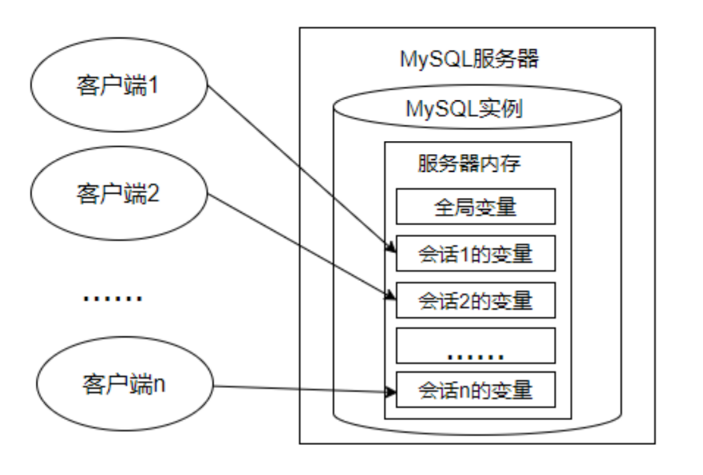

# 第16章 变量、流程控制与游标

## 1. 变量

在MySQL数据库的存储过程和函数中，可以使用变量来存储查询或计算的中间结果数据，或者输出最终的结果数据。

在 MySQL 数据库中，变量分为`系统变量`以及`用户自定义变量`。

### 1.1 系统变量

#### 1.1.1 系统变量说明

变量由系统定义，不是用户定义，属于`服务器`层面。启动MySQL服务，生成MySQL服务实例期间，MySQL将为MySQL服务器内存中的系统变量赋值，这些系统变量定义了当前MySQL服务实例的属性、特征。这些系统变量的值要么是`编译MySQL时参数`的默认值，要么是`配置文件`（例如my.ini等）中的参数值。可以通过网址https://dev.mysql.com/doc/refman/8.0/en/server-system-variables.html查看MySQL文档的系统变量。

系统变量分为全局系统变量（需要添加`global`关键字）以及会话系统变量（需要添加`session`关键字），有时也把全局系统变量简称为全局变量，有时也把会话系统变量称为local变量。**如果不写，默认会话级别**。静态变量（在 MySQL 服务实例运行期间它们的值不能使用 set 动态修改）属于特殊的全局系统变量。

每一个MySQL客户机成功连接MySQL服务器后，都会产生与之对应的会话。会话期间，MySQL服务实例会在MySQL服务器内存中生成与该会话对应的会话系统变量，这些会话系统变量的初始值是全局系统变量值的复制。如下图：



* 全局系统变量针对于所有会话（连接）有效，但`不能跨重启`
* 会话系统变量仅针对于当前会话（连接）有效。会话期间，当前会话对某个会话系统变量值的修改，不会影响其他会话同一个会话系统变量的值。
* 会话1对某个全局系统变量值的修改会导致会话2中同一个全局系统变量值的修改。

在MySQL中有些系统变量只能是全局的，例如 max_connections 用于限制服务器的最大连接数；有些系统变量作用域既可以是全局又可以是会话，例如 character_set_client 用于设置客户端的字符集；有些系统变量的作用域只能是当前会话，例如 pseudo_thread_id 用于标记当前会话的 MySQL 连接 ID。

#### 1.1.2 查看系统变量

* 查看所有或部分系统变量

```sql
# 查看所有全局变量
SHOW GLOBAL VARIABLES;

# 查看所有会话变量
SHOW SESSION VARIABLES;
# 或
SHOW VARIABLES;
```

```sql
# 查看满足条件的部分系统变量。
SHOW GLOBAL VARIABLES LIKE '%标识符%';

# 查看满足条件的部分会话变量
SHOW SESSION VARIABLES LIKE '%标识符%';
```

举例：

```sql
SHOW GLOBAL VARIABLES LIKE 'admin_%';
```

* 查看指定系统变量

作为 MySQL 编码规范，MySQL 中的系统变量以`两个“@”`开头，其中“@@global”仅用于标记全局系统变量，“@@session”仅用于标记会话系统变量。“@@”首先标记会话系统变量，如果会话系统变量不存在，则标记全局系统变量。

```sql
# 查看指定的系统变量的值
SELECT @@global.变量名;

# 查看指定的会话变量的值
SELECT @@session.变量名;
# 或者
SELECT @@变量名;
```

* 修改系统变量的值

有些时候，数据库管理员需要修改系统变量的默认值，以便修改当前会话或者MySQL服务实例的属性、特征。具体方法：

方式1：修改MySQL 配置文件 ，继而修改MySQL系统变量的值（该方法需要重启MySQL服务）

方式2：在MySQL服务运行期间，使用“set”命令重新设置系统变量的值

```sql
#为某个系统变量赋值
#方式1：
SET @@global.变量名=变量值;

#方式2：
SET GLOBAL 变量名=变量值;

#为某个会话变量赋值
#方式1：
SET @@session.变量名=变量值;

#方式2：
SET SESSION 变量名=变量值;
```

举例：

```sql
SELECT @@global.autocommit;
SET GLOBAL autocommit=0;

SELECT @@session.tx_isolation;
SET @@session.tx_isolation='read-uncommitted';

SET GLOBAL max_connections = 1000;
SELECT @@global.max_connections;
```

### 1.2 用户变量

#### 1.2.1 用户变量分类

用户变量是用户自己定义的，作为 MySQL 编码规范，MySQL 中的用户变量以`一个“@”`开头。根据作用范围不同，又分为`会话用户变量`和`局部变量`。

* 会话用户变量：作用域和会话变量一样，只对`当前连接`会话有效。
* 局部变量：只在 BEGIN 和 END 语句块中有效。局部变量只能在`存储过程和函数`中使用。

#### 1.2.2 会话用户变量

* 变量的定义

```sql
#方式1：“=”或“:=”
SET @用户变量 = 值;
SET @用户变量 := 值;

#方式2：“:=” 或 INTO关键字
SELECT @用户变量 := 表达式 [FROM 等子句];
SELECT 表达式 INTO @用户变量 [FROM 等子句];
```

* 查看用户变量的值 （查看、比较、运算等）

```sql
SELECT @用户变量
```

* 举例

```sql
SET @a = 1;

SELECT @a;
```

```sql
SELECT @num := COUNT(*) FROM employees;
    
SELECT @num;
```

```sql
SELECT AVG(salary) INTO @avgsalary FROM employees;
    
SELECT @avgsalary;
```

```sql
SELECT @big; #查看某个未声明的变量时，将得到NULL值
```

#### 1.2.3 局部变量

定义：可以使用`DECLARE`语句定义一个局部变量
作用域：仅仅在定义它的 BEGIN ... END 中有效
位置：只能放在 BEGIN ... END 中，而且只能放在第一句

```sql
BEGIN
    #声明局部变量
    DECLARE 变量名1 变量数据类型 [DEFAULT 变量默认值];
    DECLARE 变量名2,变量名3,... 变量数据类型 [DEFAULT 变量默认值];
    
    #为局部变量赋值
    SET 变量名1 = 值;
    SELECT 值 INTO 变量名2 [FROM 子句];
    
    #查看局部变量的值
    SELECT 变量1,变量2,变量3;
END
```

1. 定义变量

```sql
DECLARE 变量名 类型 [default 值]; # 如果没有DEFAULT子句，初始值为NULL
```

举例：

```sql
DECLARE myparam INT DEFAULT 100;
```

2. 变量赋值

方式1：一般用于赋简单的值

```sql
SET 变量名=值;
SET 变量名:=值;
```

方式2：一般用于赋表中的字段值

```sql
SELECT 字段名或表达式 INTO 变量名 FROM 表;
```

3. 使用变量（查看、比较、运算等）

```sql
SELECT 局部变量名;
```

举例1：声明局部变量，并分别赋值为employees表中employee_id为102的last_name和salary

```sql
DELIMITER //

CREATE PROCEDURE set_value()
BEGIN
    DECLARE emp_name VARCHAR(25);
    DECLARE sal DOUBLE(10, 2);
    
    SELECT last_name, salary
    INTO emp_name,sal
    FROM employees
    WHERE employee_id = 102;
    
    SELECT emp_name, sal;
END //

DELIMITER ;
```

举例2：声明两个变量，求和并打印 （分别使用会话用户变量、局部变量的方式实现）
    
```sql
#方式1：使用用户变量
SET @m=1;
SET @n=1;
SET @sum=@m+@n;
SELECT @sum;

#方式2：使用局部变量
DELIMITER //

CREATE PROCEDURE add_value()
BEGIN
    #局部变量
    DECLARE m INT DEFAULT 1;
    DECLARE n INT DEFAULT 3;
    DECLARE SUM INT;
    
    SET SUM = m + n;
    
    SELECT SUM;
END //

DELIMITER ;
```

举例3：创建存储过程“different_salary”查询某员工和他领导的薪资差距，并用IN参数emp_id接收员工id，用OUT参数dif_salary输出薪资差距结果。

```sql
#声明
DELIMITER //

CREATE PROCEDURE different_salary(IN emp_id INT, OUT dif_salary DOUBLE)
BEGIN
    #声明局部变量
    DECLARE emp_sal,mgr_sal DOUBLE DEFAULT 0.0;
    DECLARE mgr_id INT;
    
    SELECT salary INTO emp_sal FROM employees WHERE employee_id = emp_id;
        
    SELECT manager_id INTO mgr_id FROM employees WHERE employee_id = emp_id;
        
    SELECT salary INTO mgr_sal FROM employees WHERE employee_id = mgr_id;
        
    SET dif_salary = mgr_sal - emp_sal;
END //

DELIMITER ;

#调用
SET @emp_id = 102;
CALL different_salary(@emp_id, @diff_sal);

#查看
SELECT @diff_sal;
```

#### 1.2.4 对比会话用户变量与局部变量

|        |      作用域       |      定义位置      |      语法       |
|:------:|:--------------:|:--------------:|:-------------:|
| 会话用户变量 |      当前会话      |    会话的任何地方     |  加@符号，不用指定类型  |
|  局部变量  | 定义它的BEGIN END中 | BEGIN END的第一句话 | 一般不用加@,需要指定类型 |

## 2. 定义条件与处理程序

`定义条件`是事先定义程序执行过程中可能遇到的问题，`处理程序`定义了在遇到问题时应当采取的处理方式，并且保证存储过程或函数在遇到警告或错误时能继续执行。这样可以增强存储程序处理问题的能力，避免程序异常停止运行。

说明：定义条件和处理程序在存储过程、存储函数中都是支持的。

### 2.1 案例分析

案例分析：创建一个名称为“UpdateDataNoCondition”的存储过程。代码如下：

```sql
DELIMITER //

CREATE PROCEDURE UpdateDataNoCondition()
BEGIN
    SET @x = 1;
    UPDATE employees SET email = NULL WHERE last_name = 'Abel';
    SET @x = 2;
    UPDATE employees SET email = 'aabbel' WHERE last_name = 'Abel';
    SET @x = 3;
END //

DELIMITER ;
```

调用存储过程：

```sql
mysql> CALL UpdateDataNoCondition();
ERROR 1048 (23000): Column 'email' cannot be null

mysql> SELECT @x;
+------+
| @x   |
+------+
| 1    |
+------+
1 row in set (0.00 sec)
```

可以看到，此时@x变量的值为1。结合创建存储过程的SQL语句代码可以得出：在存储过程中未定义条件和处理程序，且当存储过程中执行的SQL语句报错时，MySQL数据库会抛出错误，并退出当前SQL逻辑，不再向下继续执行。

### 2.2 定义条件

定义条件就是给MySQL中的错误码命名，这有助于存储的程序代码更清晰。它将一个`错误名字`和`指定的错误条件`关联起来。这个名字可以随后被用在定义处理程序的`DECLARE HANDLER`语句中。

定义条件使用DECLARE语句，语法格式如下：

```sql
DECLARE 错误名称 CONDITION FOR 错误码（或错误条件）
```

错误码的说明：

* `MySQL_error_code`和`sqlstate_value`都可以表示MySQL的错误。
  - MySQL_error_code是数值类型错误代码。
  - sqlstate_value是长度为5的字符串类型错误代码。
* 例如，在ERROR 1418 (HY000)中，1418是MySQL_error_code，'HY000'是sqlstate_value。
* 例如，在ERROR 1142（42000）中，1142是MySQL_error_code，'42000'是sqlstate_value。

举例1：

定义“Field_Not_Be_NULL”错误名与MySQL中违反非空约束的错误类型是“ERROR 1048 (23000)”对应。

```sql
# 使用MySQL_error_code
DECLARE Field_Not_Be_NULL CONDITION FOR 1048;

# 使用sqlstate_value
DECLARE Field_Not_Be_NULL CONDITION FOR SQLSTATE '23000';
```

举例2：

定义"ERROR 1148(42000)"错误，名称为command_not_allowed。

```sql
# 使用MySQL_error_code
DECLARE command_not_allowed CONDITION FOR 1148;

# 使用sqlstate_value
DECLARE command_not_allowed CONDITION FOR SQLSTATE '42000';
```

### 2.3 定义处理程序

可以为SQL执行过程中发生的某种类型的错误定义特殊的处理程序。定义处理程序时，使用DECLARE语句的语法如下：

```sql
DECLARE 处理方式 HANDLER FOR 错误类型 处理语句
```

* 处理方式：处理方式有3个取值：CONTINUE、EXIT、UNDO。
  - `CONTINUE`：表示遇到错误不处理，继续执行。
  - `EXIT`：表示遇到错误马上退出。
  - `UNDO`：表示遇到错误后撤回之前的操作。MySQL中暂时不支持这样的操作。
* 错误类型（即条件）可以有如下取值：
  - `SQLSTATE '字符串错误码'`：表示长度为5的sqlstate_value类型的错误代码；
  - `MySQL_error_code`：匹配数值类型错误代码；
  - `错误名称`：表示DECLARE ... CONDITION定义的错误条件名称。
  - `SQLWARNING`：匹配所有以01开头的SQLSTATE错误代码；
  - `NOT FOUND`：匹配所有以02开头的SQLSTATE错误代码；
  - `SQLEXCEPTION`：匹配所有没有被SQLWARNING或NOT FOUND捕获的SQLSTATE错误代码；
* 处理语句：如果出现上述条件之一，则采用对应的处理方式，并执行指定的处理语句。语句可以是像`SET 变量 = 值`这样的简单语句，也可以是使用`BEGIN ... END`编写的复合语句。

定义处理程序的几种方式，代码如下：

```sql
# 方法1：捕获sqlstate_value
DECLARE CONTINUE HANDLER FOR SQLSTATE '42S02' SET @info = 'NO_SUCH_TABLE';
    
# 方法2：捕获mysql_error_value
DECLARE CONTINUE HANDLER FOR 1146 SET @info = 'NO_SUCH_TABLE';
    
# 方法3：先定义条件，再调用
DECLARE no_such_table CONDITION FOR 1146;
DECLARE CONTINUE HANDLER FOR NO_SUCH_TABLE SET @info = 'NO_SUCH_TABLE';
    
# 方法4：使用SQLWARNING
DECLARE EXIT HANDLER FOR SQLWARNING SET @info = 'ERROR';
    
# 方法5：使用NOT FOUND
DECLARE EXIT HANDLER FOR NOT FOUND SET @info = 'NO_SUCH_TABLE';
    
# 方法6：使用SQLEXCEPTION
DECLARE EXIT HANDLER FOR SQLEXCEPTION SET @info = 'ERROR';
```

### 2.4 案例解决

在存储过程中，定义处理程序，捕获sqlstate_value值，当遇到MySQL_error_code值为1048时，执行CONTINUE操作，并且将@proc_value的值设置为-1。

```sql
DELIMITER //

CREATE PROCEDURE UpdateDataNoCondition()
BEGIN
  #定义处理程序
  DECLARE CONTINUE HANDLER FOR 1048 SET @proc_value = -1;
    
  SET @x = 1;
  UPDATE employees SET email = NULL WHERE last_name = 'Abel';
  SET @x = 2;
  UPDATE employees SET email = 'aabbel' WHERE last_name = 'Abel';
  SET @x = 3;
END //

DELIMITER ;
```

调用过程：

```sql
mysql> CALL UpdateDataWithCondition();
Query OK, 0 rows affected (0.01 sec)

mysql> SELECT @x,@proc_value;
+------+-------------+
| @x   | @proc_value |
+------+-------------+
| 3    |          -1 |
+------+-------------+
1 row in set (0.00 sec)
```

举例：

创建一个名称为“InsertDataWithCondition”的存储过程，代码如下。

在存储过程中，定义处理程序，捕获sqlstate_value值，当遇到sqlstate_value值为23000时，执行EXIT操作，并且将@proc_value的值设置为-1。

```sql
#准备工作
CREATE TABLE departments
AS
SELECT *
FROM atguigudb.`departments`;

ALTER TABLE departments
  ADD CONSTRAINT uk_dept_name UNIQUE (department_id);
```

```sql
DELIMITER //

CREATE PROCEDURE InsertDataWithCondition()
BEGIN
  DECLARE duplicate_entry CONDITION FOR SQLSTATE '23000';
  DECLARE EXIT HANDLER FOR duplicate_entry SET @proc_value = -1;
    
  SET @x = 1;
  INSERT INTO departments(department_name) VALUES ('测试');
  SET @x = 2;
  INSERT INTO departments(department_name) VALUES ('测试');
  SET @x = 3;
END //

DELIMITER ;
```

调用存储过程：

```sql
mysql> CALL InsertDataWithCondition();
Query OK, 0 rows affected (0.01 sec)

mysql> SELECT @x,@proc_value;
+------+-------------+
| @x   | @proc_value |
+------+-------------+
| 2    |          -1 |
+------+-------------+
1 row in set (0.00 sec)
```

## 3. 流程控制

解决复杂问题不可能通过一个 SQL 语句完成，我们需要执行多个 SQL 操作。流程控制语句的作用就是控制存储过程中 SQL 语句的执行顺序，是我们完成复杂操作必不可少的一部分。只要是执行的程序，流程就分为三大类：

* 顺序结构 ：程序从上往下依次执行
* 分支结构 ：程序按条件进行选择执行，从两条或多条路径中选择一条执行
* 循环结构 ：程序满足一定条件下，重复执行一组语句

针对于MySQL 的流程控制语句主要有 3 类。注意：只能用于存储程序。

* 条件判断语句 ：IF 语句和 CASE 语句
* 循环语句 ：LOOP、WHILE 和 REPEAT 语句
* 跳转语句 ：ITERATE 和 LEAVE 语句

### 3.1 分支结构之 IF

* IF 语句的语法结构是：

```sql
IF 表达式1 THEN 操作1
[ELSEIF 表达式2 THEN 操作2]……
[ELSE 操作N]
END IF
```

根据表达式的结果为TRUE或FALSE执行相应的语句。这里“[]”中的内容是可选的。

* 特点：
  1. 不同的表达式对应不同的操作
  2. 使用在begin end中
* 举例1：

```sql
IF val IS NULL
THEN SELECT 'val is null';
ELSE SELECT 'val is not null';
END IF;
```

* 举例2：声明存储过程“update_salary_by_eid1”，定义IN参数emp_id，输入员工编号。判断该员工薪资如果低于8000元并且入职时间超过5年，就涨薪500元；否则就不变。

```sql
DELIMITER //

CREATE PROCEDURE update_salary_by_eid1(IN emp_id INT)
BEGIN
  DECLARE emp_salary DOUBLE;
  DECLARE hire_year DOUBLE;
  
  SELECT salary INTO emp_salary FROM employees WHERE employee_id = emp_id;
  
  SELECT DATEDIFF(CURDATE(), hire_date) / 365
  INTO hire_year
  FROM employees
  WHERE employee_id = emp_id;
  
  IF emp_salary < 8000 AND hire_year > 5
  THEN
    UPDATE employees SET salary = salary + 500 WHERE employee_id = emp_id;
  END IF;
END //

DELIMITER ;
```

* 举例3：声明存储过程“update_salary_by_eid2”，定义IN参数emp_id，输入员工编号。判断该员工薪资如果低于9000元并且入职时间超过5年，就涨薪500元；否则就涨薪100元。

```sql
DELIMITER //

CREATE PROCEDURE update_salary_by_eid2(IN emp_id INT)
BEGIN
  DECLARE emp_salary DOUBLE;
  DECLARE hire_year DOUBLE;
  
  SELECT salary INTO emp_salary FROM employees WHERE employee_id = emp_id;
    
  SELECT DATEDIFF(CURDATE(), hire_date) / 365
  INTO hire_year
  FROM employees
  WHERE employee_id = emp_id;
  
  IF emp_salary < 8000 AND hire_year > 5
  THEN
    UPDATE employees
    SET salary = salary + 500
    WHERE employee_id =
          emp_id;
  ELSE
    UPDATE employees SET salary = salary + 100 WHERE employee_id = emp_id;
  END IF;
END //

DELIMITER ;
```

* 举例4：声明存储过程“update_salary_by_eid3”，定义IN参数emp_id，输入员工编号。判断该员工薪资如果低于9000元，就更新薪资为9000元；薪资如果大于等于9000元且低于10000的，但是奖金比例为NULL的，就更新奖金比例为0.01；其他的涨薪100元。

```sql
DELIMITER //

CREATE PROCEDURE update_salary_by_eid3(IN emp_id INT)
BEGIN
  DECLARE emp_salary DOUBLE;
  DECLARE bonus DECIMAL(3, 2);
  
  SELECT salary INTO emp_salary FROM employees WHERE employee_id = emp_id;
    
  SELECT commission_pct INTO bonus FROM employees WHERE employee_id = emp_id;

  IF emp_salary < 9000
  THEN
    UPDATE employees SET salary = 9000 WHERE employee_id = emp_id;
  ELSEIF emp_salary < 10000 AND bonus IS NULL
  THEN
    UPDATE employees
    SET commission_pct = 0.01
    WHERE employee_id =
          emp_id;
  ELSE
    UPDATE employees SET salary = salary + 100 WHERE employee_id = emp_id;
  END IF;
END //

DELIMITER ;
```

### 3.2 分支结构之 CASE

CASE 语句的语法结构1：

```sql
#情况一：类似于switch
CASE 表达式
WHEN 值1 THEN 结果1或语句1(如果是语句，需要加分号)
WHEN 值2 THEN 结果2或语句2(如果是语句，需要加分号)
...
ELSE 结果n或语句n(如果是语句，需要加分号)
END [case]（如果是放在begin end中需要加上case，如果放在select后面不需要）
```

CASE 语句的语法结构2：

```sql
#情况二：类似于多重if
CASE
WHEN 条件1 THEN 结果1或语句1(如果是语句，需要加分号)
WHEN 条件2 THEN 结果2或语句2(如果是语句，需要加分号)
...
ELSE 结果n或语句n(如果是语句，需要加分号)
END [case]（如果是放在begin end中需要加上case，如果放在select后面不需要）
```

* 举例1：

使用CASE流程控制语句的第1种格式，判断val值等于1、等于2，或者两者都不等。

```sql
CASE val
    WHEN 1 THEN SELECT 'val is 1';
    WHEN 2 THEN SELECT 'val is 2';
    ELSE SELECT 'val is not 1 or 2';
END CASE;
```

* 举例2：

使用CASE流程控制语句的第2种格式，判断val是否为空、小于0、大于0或者等于0。

```sql
CASE
    WHEN val IS NULL THEN SELECT 'val is null';
    WHEN val < 0 THEN SELECT 'val is less than 0';
    WHEN val > 0 THEN SELECT 'val is greater than 0';
    ELSE SELECT 'val is 0';
END CASE;
```

* 举例3：声明存储过程“update_salary_by_eid4”，定义IN参数emp_id，输入员工编号。判断该员工薪资如果低于9000元，就更新薪资为9000元；薪资大于等于9000元且低于10000的，但是奖金比例为NULL的，就更新奖金比例为0.01；其他的涨薪100元。

```sql
DELIMITER //

CREATE PROCEDURE update_salary_by_eid4(IN emp_id INT)
BEGIN
  DECLARE emp_sal DOUBLE;
  DECLARE bonus DECIMAL(3, 2);
  
  SELECT salary INTO emp_sal FROM employees WHERE employee_id = emp_id;
    
  SELECT commission_pct INTO bonus FROM employees WHERE employee_id = emp_id;
    
  CASE
    WHEN emp_sal < 9000
      THEN UPDATE employees SET salary=9000 WHERE employee_id = emp_id;
    WHEN emp_sal < 10000 AND bonus IS NULL
      THEN UPDATE employees SET commission_pct=0.01 WHERE employee_id = emp_id;
    ELSE
      UPDATE employees SET salary=salary + 100 WHERE employee_id = emp_id;
    END CASE;
END //
DELIMITER ;
```

* 举例4：声明存储过程update_salary_by_eid5，定义IN参数emp_id，输入员工编号。判断该员工的入职年限，如果是0年，薪资涨50；如果是1年，薪资涨100；如果是2年，薪资涨200；如果是3年，薪资涨300；如果是4年，薪资涨400；其他的涨薪500。

```sql
DELIMITER //

CREATE PROCEDURE update_salary_by_eid5(IN emp_id INT)
BEGIN
  DECLARE emp_sal DOUBLE;
  DECLARE hire_year DOUBLE;
  
  SELECT salary INTO emp_sal FROM employees WHERE employee_id = emp_id;
    
  SELECT ROUND(DATEDIFF(CURDATE(), hire_date) / 365)
  INTO hire_year
  FROM employees
  WHERE employee_id = emp_id;
  
  CASE hire_year
    WHEN 0 THEN UPDATE employees SET salary=salary + 50 WHERE employee_id = emp_id;
    WHEN 1 THEN UPDATE employees SET salary=salary + 100 WHERE employee_id = emp_id;
    WHEN 2 THEN UPDATE employees SET salary=salary + 200 WHERE employee_id = emp_id;
    WHEN 3 THEN UPDATE employees SET salary=salary + 300 WHERE employee_id = emp_id;
    WHEN 4 THEN UPDATE employees SET salary=salary + 400 WHERE employee_id = emp_id;
    ELSE UPDATE employees SET salary=salary + 500 WHERE employee_id = emp_id;
    END CASE;
END //

DELIMITER ;
```

### 3.3 循环结构之LOOP

LOOP循环语句用来重复执行某些语句。LOOP内的语句一直重复执行直到循环被退出（使用LEAVE子句），跳出循环过程。

LOOP语句的基本格式如下：

```sql
[loop_label:] LOOP
循环执行的语句
END LOOP [loop_label]
```

其中，loop_label表示LOOP语句的标注名称，该参数可以省略。

举例1：

使用LOOP语句进行循环操作，id值小于10时将重复执行循环过程。


